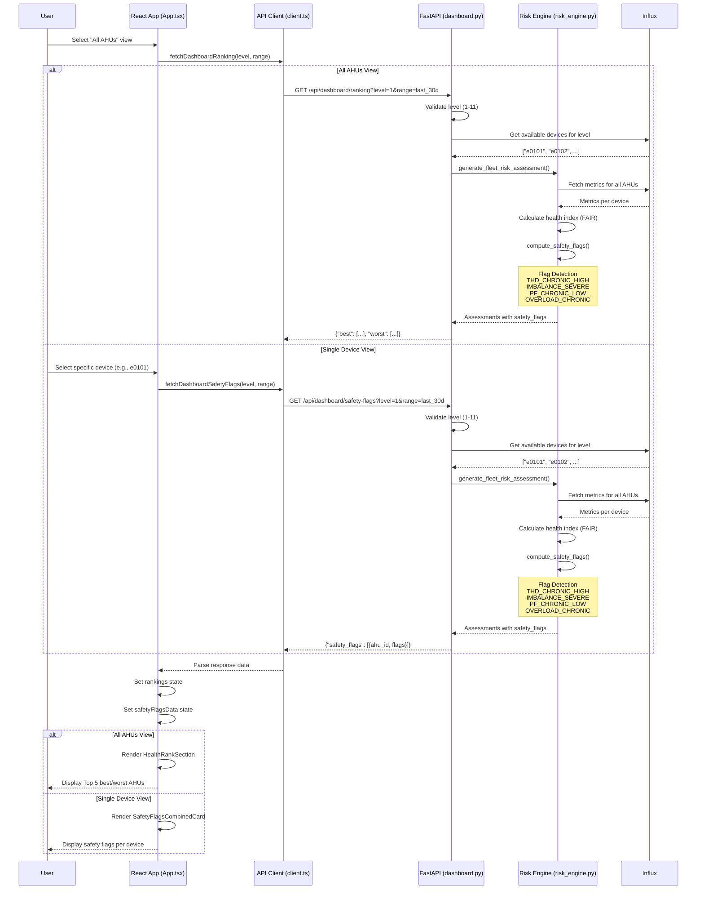
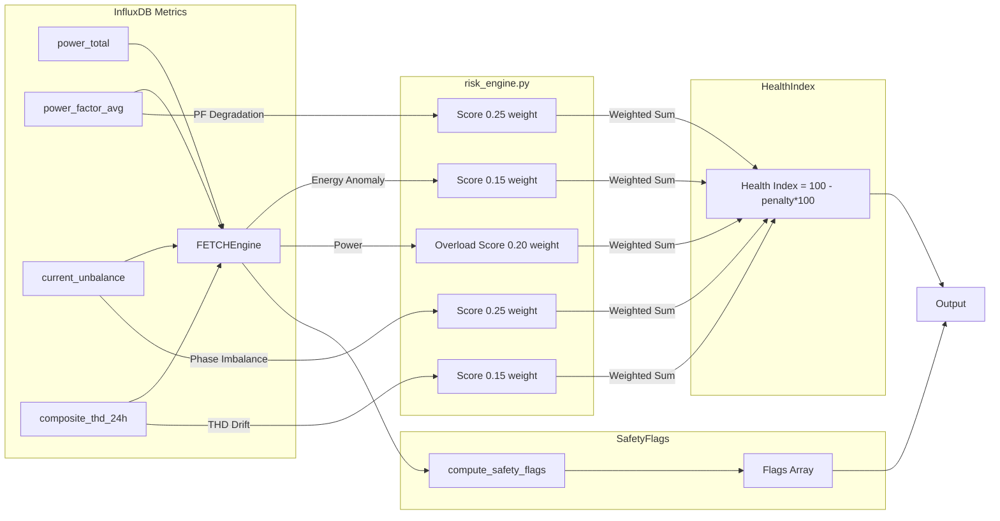

# Health Rankings & Safety Flags Architecture

## System Architecture Overview

```
┌─────────────────────────────────────────────────────────────────────────────┐
│                            USER INTERFACE (React)                           │
├─────────────────────────────────────────────────────────────────────────────┤
│                                                                             │
│  ┌──────────────────┐           ┌──────────────────────┐                  │
│  │   App.tsx        │           │  Device Selection    │                  │
│  │  - View Control  │──────────▶│  - All AHUs /        │                  │
│  │  - State Mgmt    │           │    Single Device     │                  │
│  └──────────────────┘           └──────────────────────┘                  │
│                                     │                                       │
│                                     ▼                                       │
│  ┌──────────────────┐    ┌──────────────────────┐   ┌─────────────────┐   │
│  │ HealthRankSection│    │ SafetyFlagsCombined  │   │   App Logic   │   │
│  │   (Fleet View)   │    │     Card             │   │  - Fetch Data │   │
│  └──────────────────┘    └──────────────────────┘   └─────────────────┘   │
│          │                        │                                        │
│          ▼                        ▼                                        │
└─────────────────────────────────────────────────────────────────────────────┘
                                    │
                                    ▼
┌─────────────────────────────────────────────────────────────────────────────┐
│                         FRONTEND API CLIENT (client.ts)                     │
├─────────────────────────────────────────────────────────────────────────────┤
│                                                                             │
│  fetchDashboardRanking(level, range)                                        │
│      └─▶ GET /api/dashboard/ranking?level=X&range=Y                       │
│                                                                             │
│  fetchDashboardSafetyFlags(level, range)                                    │
│      └─▶ GET /api/dashboard/safety-flags?level=X&range=Y                  │
│                                                                             │
└─────────────────────────────────────────────────────────────────────────────┘
                                    │
                                    ▼
┌─────────────────────────────────────────────────────────────────────────────┐
│                         FASTAPI BACKEND (dashboard.py)                      │
├─────────────────────────────────────────────────────────────────────────────┤
│                                                                             │
│  ┌──────────────────────────────────────────────────────────────────────┐  │
│  │  @router.get("/ranking")                                             │  │
│  │  - Validates level (1-11)                                            │  │
│  │  - Filters devices by level prefix                                   │  │
│  │  - Calls generate_fleet_risk_assessment()                            │  │
│  │  - Returns Top 5 best/worst AHUs                                     │  │
│  └──────────────────────────────────────────────────────────────────────┘  │
│                                     │                                       │
│                                     ▼                                       │
│  ┌──────────────────────────────────────────────────────────────────────┐  │
│  │  @router.get("/safety-flags") (NEW)                                  │  │
│  │  - Validates level (1-11)                                            │  │
│  │  - Filters devices by level prefix                                   │  │
│  │  - Calls generate_fleet_risk_assessment()                            │  │
│  │  - Extracts and formats safety_flags per device                      │  │
│  └──────────────────────────────────────────────────────────────────────┘  │
│                                     │                                       │
└─────────────────────────────────────────────────────────────────────────────┘
                                    │
                                    ▼
┌─────────────────────────────────────────────────────────────────────────────┐
│                      RISK ENGINE (risk_engine.py)                           │
├─────────────────────────────────────────────────────────────────────────────┤
│                                                                             │
│  ┌──────────────────────────────────────────────────────────────────────┐  │
│  │  generate_fleet_risk_assessment()                                    │  │
│  │    - Fetches metrics from InfluxDB                                   │  │
│  │    - Calculates health index (FAIR algorithm)                        │  │
│  │    ┌──────────────────────────────────────────────────────────────┐ │ │
│  │    │ compute_safety_flags(metrics)                                │ │ │
│  │    │   - THD_CHRONIC_HIGH: composite_thd_24h > 15.0%             │ │ │
│  │    │   - IMBALANCE_SEVERE: current_unbalance > 30.0%             │ │ │
│  │    │   - PF_CHRONIC_LOW: power_factor_avg < 0.50                 │ │ │
│  │    │   - OVERLOAD_CHRONIC: power_total > 90% p95                 │ │ │
│  │    └──────────────────────────────────────────────────────────────┘ │ │
│  │    - Returns assessments with safety_flags field                     │ │
│  └──────────────────────────────────────────────────────────────────────┘  │
│                                                                             │
└─────────────────────────────────────────────────────────────────────────────┘
                                    │
                                    ▼
┌─────────────────────────────────────────────────────────────────────────────┐
│                           INFLUXDB (wach_bucket_3)                          │
├─────────────────────────────────────────────────────────────────────────────┤
│                                                                             │
│  buckets:                                                                   │
│    - wach_bucket_3                                                          │
│  measurements:                                                              │
│    - power_total, energy_import                                            │
│    - power_factor_avg                                                      │
│    - current_unbalance                                                     │
│    - composite_thd_24h                                                     │
│                                                                             │
└─────────────────────────────────────────────────────────────────────────────┘
```

---

## Data Flow Diagram



---

## Component Hierarchy

```
App (App.tsx)
│
├── LevelSelectorBar (level picker)
│
├── DeviceSelector (device selection)
│   ├── "All AHUs" option → healthIndex + scoreCards
│   └── Device ID option → single device view
│
├── HealthIndexChart (health trends)
│
├── ScoreCardsGrid (5 FAIR score cards)
│
├── CombinedScoresChart (all scores overlay)
│
└── [Conditional Render Based on Device Selection]
    │
    ├── If selectedDevice === 'all'
    │   ├── HealthRankSection (NEW) ← Top 5 best/worst
    │   └── NO SafetyFlagsCombinedCard
    │
    └── If selectedDevice !== 'all'
        ├── NO HealthRankSection
        └── SafetyFlagsCombinedCard (NEW) ← Flags for single device
```

---

## Key Components Breakdown

### HealthRankSection Component

**Purpose**: Displays fleet-level rankings

**When Used**: When user selects "All AHUs" view

**Props**:
```typescript
{
  bestDevices: DeviceRank[],    // Top 5 healthiest (highest index)
  worstDevices: DeviceRank[]    // Top 5 needs attention (lowest index)
}
```

**Internal Logic**:
1. Receives best/worst arrays from parent (App.tsx)
2. Renders "Top 5 Healthiest" section with green styling
3. Renders "Top 5 Needs Attention" section with red styling
4. Each card shows:
   - Rank number (#1, #2, etc.)
   - AHU ID (e0101, e0105, etc.)
   - Health index (89.7, 94.2, etc.)
   - Tier badge (Healthy/Monitor/Maintenance Soon/Critical)

**Severity Color Mapping**:
| Range | Text | Badge Background |
|-------|------|------------------|
| 80-100 | Green (#00E5A0) | Green 10% |
| 60-79 | Amber (#FFB020) | Amber 10% |
| 40-59 | Orange (#FFA500) | Orange 10% |
| 0-39 | Red (#FF4D6A) | Red 10% |

---

### SafetyFlagsCombinedCard Component

**Purpose**: Displays safety flags for single device

**When Used**: When user selects specific AHU (e.g., e0101)

**Props**:
```typescript
{
  deviceId: string;      // e.g., "e0101"
  deviceName?: string;   // Optional display name
  safetyFlags: SafetyFlag[];  // Array of flag objects
}
```

**SafetyFlag Structure**:
```typescript
{
  flag_id: string;        // THD_CHRONIC_HIGH, etc.
  label: string;          // "THD Critical", etc.
  severity: 'High' | 'Moderate' | 'Low';
  threshold?: string;     // ">15.0%", "<0.50", etc.
}
```

**Render Logic**:
1. If no flags → Show checkmark message
2. If flags exist → Render each flag with:
   - Icon (⚡ for THD, ⚖️ for Imbalance, etc.)
   - Label and threshold
   - Severity badge (Critical/Warning/Info)
3. Footer shows count of flags detected

**Severity Badge Mapping**:
| Severity | Label | Background/Text |
|----------|-------|-----------------|
| High | Critical | Red (#FF4D6A) |
| Moderate | Warning | Amber (#FFB020) |
| Low | Info | Green (#00E5A0) |

---

## API Endpoint Architecture

### GET /api/dashboard/ranking (Existing)

**Flow**:
```
User Request → Backend → Validate → Filter Devices → Fetch Metrics
                ↓
            Calculate Health Indices
                ↓
          Sort by health_index DESC
                ↓
        Return Top 5 best + worst
```

**Code Path**:
1. `@router.get("/ranking")` handler in `dashboard.py`
2. Validates level parameter (1-11)
3. Calls `get_available_devices(time_range)`
4. Filters devices by level prefix (e.g., e01 for Level 1)
5. Calls `generate_fleet_risk_assessment()`
6. Extracts health_index from assessments
7. Sorts and returns top 5 best/worst

---

### GET /api/dashboard/safety-flags (NEW)

**Flow**:
```
User Request → Backend → Validate → Filter Devices → Fetch Metrics
                ↓
            Calculate Health Indices + Safety Flags
                ↓
        Extract safety_flags field per device
                ↓
    Format as [{ahu_id, flags: [...]}]
```

**Code Path**:
1. `@router.get("/safety-flags")` handler in `dashboard.py`
2. Validates level parameter (1-11)
3. Calls `get_available_devices(time_range)`
4. Filters devices by level prefix
5. Calls `generate_fleet_risk_assessment()`
6. Extracts safety_flags from assessments
7. Maps to output format with labels and thresholds

---

### GET /api/dashboard/trend (Modified)

**Changes**: Added `safety_flags` to response

**New Response Structure**:
```json
{
  "level": "1",
  "range": "7d",
  "ahus": [...],
  "series": [...],        // Time series data
  "latest_snapshot": {...}, // Latest health indices
  "safety_flags": {       // NEW: Safety flags per device
    "e0101": [{"flag_id": "...", "label": "...", "severity": "..."}],
    ...
  }
}
```

---

## Backend Core Logic

### SAFETY_FLAGS_DEF Constant

**Location**: `backend/core/risk_engine.py` line ~1589

```python
SAFETY_FLAGS_DEF = {
    "THD_CHRONIC_HIGH":   ("composite_thd_24h", ">", 15.0),
    "IMBALANCE_SEVERE":   ("current_unbalance",  ">", 30.0),
    "PF_CHRONIC_LOW":     ("power_factor_avg",   "<",  0.50),
    "OVERLOAD_CHRONIC":   ("power_total",        ">",  None),  # computed separately
}
```

**Structure**: Maps flag ID → (metric_name, operator, threshold)

**Note**: OVERLOAD uses special logic (power > 90% of p95), hence None threshold

---

### compute_safety_flags() Function

**Location**: `backend/core/risk_engine.py` line ~1597

```python
def compute_safety_flags(metrics: Dict) -> List[str]:
    """
    Evaluate AHU metrics against structural safety thresholds.
    
    Returns list of flag strings for this AHU.
    """
```

**Input**: Metrics dictionary from InfluxDB (one AHU)

**Output**: List of flag IDs (empty if no issues)

**Detection Logic**:
```python
flags = []

# 1. THD Check
thd_val = metrics.get("thd", {}).get("composite_24h_mean")
if thd_val is not None and thd_val > 15.0:
    flags.append("THD_CHRONIC_HIGH")

# 2. Imbalance Check
unbal_val = metrics.get("phase_imbalance", {}).get("current")
if unbal_val is not None and unbal_val > 30.0:
    flags.append("IMBALANCE_SEVERE")

# 3. PF Check
pf_val = metrics.get("power_factor", {}).get("current")
if pf_val is not None and pf_val < 0.50:
    flags.append("PF_CHRONIC_LOW")

# 4. Overload Check
power_val = metrics.get("power", {}).get("current")
historical_p95 = metrics.get("power", {}).get("historical_p95")
if (power_val is not None and historical_p95 is not None
    and power_val / historical_p95 > 0.90):
    flags.append("OVERLOAD_CHRONIC")

return flags
```

---

## Health Index Calculation (FAIR Algorithm)



---

## State Management Flow

### App.tsx State Structure

```typescript
// Score card data
const [healthData, setHealthData] = useState<HealthIndexResponse | null>(null);
const [scoresData, setScoresData] = useState<ScoresResponse | null>(null);

// Ranking data (NEW)
const [rankings, setRankings] = useState<{
  best: Array<{ ahu_id: string; index: number }>;
  worst: Array<{ ahu_id: string; index: number }>;
} | null>(null);

// Safety flags data (NEW)
const [safetyFlagsData, setSafetyFlagsData] = useState<
  Record<string, Array<{ flag_id: string; label: string; severity: string }>>
 | null>(null);

const [isLoading, setIsLoading] = useState(false);
const [error, setError] = useState<string | null>(null);
```

### Fetch Logic (App.tsx useEffect)

```typescript
// When level/device/range changes
React.useEffect(() => {
  if (!selectedLevel) return;
  setIsLoading(true);
  setError(null);

  Promise.all([
    fetchHealthIndex(selectedLevel, timeRange, selectedDevice),
    fetchScoreBreakdown(selectedLevel, timeRange),
  ])
    .then(([health, scores]) => {
      setHealthData(health);
      setScoresData(scores);
      
      // NEW: Fetch rankings when All AHUs selected
      if (selectedDevice === 'all') {
        fetchDashboardRanking(selectedLevel, range)
          .then(data => setRankings({
            best: data.best,
            worst: data.worst
          }))
          .catch(() => setRankings(null));
      }
    })
    .catch((err) => setError(err.message))
    .finally(() => setIsLoading(false));
}, [selectedLevel, selectedDevice, timeRange]);

// NEW: Safety flags fetch (when single device)
React.useEffect(() => {
  if (!selectedDevice || selectedDevice === 'all') {
    setSafetyFlagsData(null);
    return;
  }
  
  fetchDashboardSafetyFlags(selectedLevel, range)
    .then(data => setSafetyFlagsData(
      data.safety_flags.reduce((acc, item) => {
        acc[item.ahu_id] = item.flags;
        return acc;
      }, {} as Record<string, any>)
    ))
    .catch(() => setSafetyFlagsData(null));
}, [selectedDevice, timeRange]);
```

---

## Threshold Configuration

### Safety Flags Thresholds

| Flag ID | Metric | Operator | Threshold | Severity |
|---------|--------|----------|-----------|----------|
| `THD_CHRONIC_HIGH` | composite_thd_24h | > | 15.0% | High |
| `IMBALANCE_SEVERE` | current_unbalance | > | 30.0% | High |
| `PF_CHRONIC_LOW` | power_factor_avg | < | 0.50 | Moderate |
| `OVERLOAD_CHRONIC` | power_total/p95 | > | 0.90 (90%) | High |

### Health Index Tier Thresholds

| Tier | Range | Color | Label |
|------|-------|-------|-------|
| Healthy | 80-100 | Green (#00E5A0) | Healthy |
| Monitor | 60-79 | Amber (#FFB020) | Monitor |
| Maintenance Soon | 40-59 | Orange (#FFA500) | Maintenance Soon |
| Critical | 0-39 | Red (#FF4D6A) | Critical |

---

## Data Contract

### Request Format

**GET /api/dashboard/ranking**

```
/api/dashboard/ranking?level=1&range=last_30d
```

**GET /api/dashboard/safety-flags**

```
/api/dashboard/safety-flags?level=1&time_range=last_30d
```

### Response Format

**ranking endpoint**:
```json
{
  "level": "1",
  "time_range": "last_30d",
  "snapshot_time": "2026-03-10T14:00:00+08:00",
  "best": [
    {"ahu_id": "e0105", "index": 94.2, "tier": "Healthy", "level": "Level 1"}
  ],
  "worst": [
    {"ahu_id": "e0112", "index": 38.5, "tier": "Critical", "level": "Level 1"}
  ]
}
```

**safety-flags endpoint**:
```json
{
  "level": "1",
  "time_range": "last_30d",
  "generated_at": "2026-03-10T14:00:00+08:00",
  "safety_flags": [
    {
      "ahu_id": "e0101",
      "flags": [
        {"flag_id": "THD_CHRONIC_HIGH", "label": "THD Critical", "severity": "High", "threshold": ">15.0%"}
      ]
    }
  ]
}
```

---

## Error Handling

### Backend Errors

| Status | Code | Message | Cause |
|--------|------|---------|-------|
| 400 | invalid_level | "Level must be between 1 and 11" | Level outside valid range |
| 400 | invalid_number | "Level must be a valid number" | Non-numeric level |
| 404 | no_devices | "No devices found for level X" | Level has no AHUs |
| 404 | no_data | "No health data available" | No assessments generated |

### Frontend Error States

| Component | Empty State |
|-----------|-------------|
| HealthRankSection | "No health data available" |
| SafetyFlagsCombinedCard | "✅ No safety flags detected for this device" |

---

## Performance Considerations

### Optimization Strategies

1. **Device Filtering**: Filter by level prefix before fetching metrics
2. **Async Calls**: Use Promise.all() for parallel data fetching
3. **Lazy Loading**: ScoreDerivationSection loads only when needed
4. **Memoization**: useMemo for derived data (chartData, devices)
5. **State Batching**: Single useState update for multiple scores

### Expected Latency

| Operation | Estimated Time |
|-----------|----------------|
| API Call (rankings) | 2-5 seconds |
| API Call (safety-flags) | 3-6 seconds |
| Component Render | <100ms |

---

## Maintenance Guidelines

### Adding New Safety Flags

1. Update `SAFETY_FLAGS_DEF` in `risk_engine.py`
2. Add detection logic to `compute_safety_flags()`
3. Update frontend component color mapping if needed
4. Update documentation thresholds table

### Adding New Health Tiers

1. Update `HEALTH_TIERS` constant in `risk_engine.py`
2. Update tier label function if needed
3. Update color mappings in frontend components

---

## Related Documents

- [Health Rankings & Safety Flags Implementation](../implementation/HEALTH_RANKINGS_SAFETY_FLAGS.md)
- [FAIR Health Scoring Documentation](../scoring/FAIR_HEALTH_SCORING_DOCUMENTATION.md)
- [Backend API Reference](../api/)

---

**Last Updated**: March 11, 2026  
**Architecture Version**: 1.0
