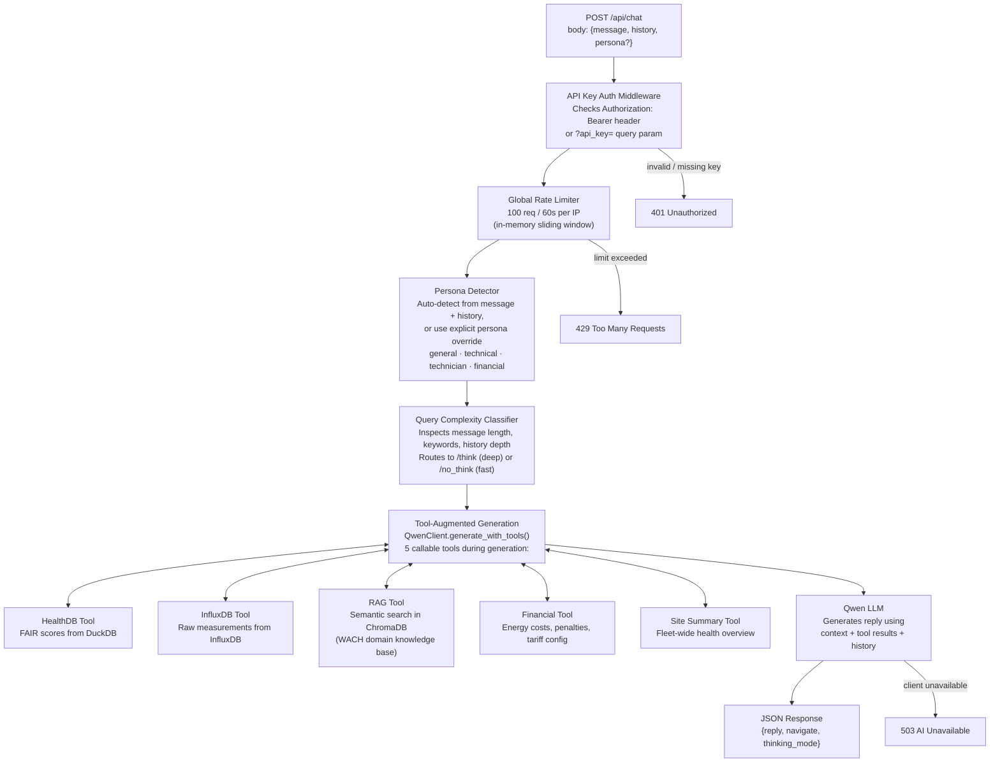

# Chat Pipeline

This diagram traces a single `POST /api/chat` request from the browser through every processing layer to the final JSON response.

## Key Design Decisions

**Persona detection is automatic.** The system reads the message and conversation history to select a persona. Explicit `persona` overrides are honoured. The selected persona changes the system prompt and available tools.

**Tool calls happen inside the LLM generation loop.** Qwen can invoke any of the five tools zero or more times before producing its final reply. Results from each tool call are appended to the context window before the next generation step.

**Thinking mode is a prefix, not a separate model.** The `QC` step prepends `/think` or `/no_think` to the user message before it reaches the LLM. This controls Qwen's internal reasoning chain depth.

**No per-endpoint rate limiter.** Unlike `POST /api/query`, the `/api/chat` endpoint relies solely on the global 100 req/60s middleware in `main.py`. If you need tighter per-session limits, add a `SlowAPI` limiter to `routes/chat.py`.

## Related Components

| File | Role |
|------|------|
| `backend/routes/chat.py` | FastAPI route handler — entry point |
| `backend/core/persona_detector.py` | Persona auto-detection logic |
| `backend/core/query_classifier.py` | Complexity routing logic |
| `backend/ai/qwen_client.py` | LLM client with tool call loop |
| `backend/tools/` | Individual tool implementations |
| `backend/middleware/` | Auth and rate limiting middleware |
