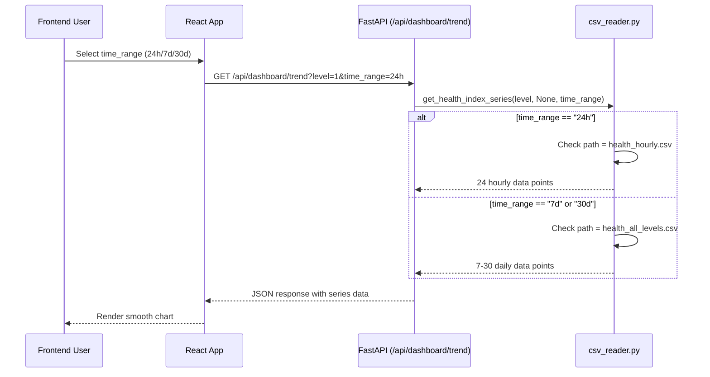

# Data Flows: Health Index CSV Architecture

## Overview

The WACH Insight system uses a **dual CSV architecture** to optimize data granularity for different time ranges:

| CSV File | Granularity | Purpose | Time Ranges |
|----------|-------------|---------|-------------|
| `data/health_hourly.csv` | **Hourly** (append-only) | Fast chart rendering for short-term views | 24h only |
| `data/health_all_levels.csv` | **Daily** (append-only) | Long-term trend analysis | 7d, 30d |

This architecture solves the problem where the 24h chart showed only **1 data point** because it was using daily-sampled data. Now the 24h chart gets **24 hourly samples** for smooth visualization.

---

## Architecture Decision

### Problem Statement
- 24h health index chart showed only 1 data point (daily aggregation)
- Users needed hourly granularity for short-term monitoring
- Reprocessing full history every 30 minutes was inefficient

### Solution: Dual CSV Strategy

```
┌─────────────────────────────────────────────────────────────────────────┐
│                        Dual CSV Architecture                             │
├─────────────────────────────────────────────────────────────────────────┤
│                                                                         │
│  ┌──────────────┐              ┌────────────────┐                      │
│  │ health_hourly│              │health_all_lev │                      │
│  │   _hourly.csv│              │    els.csv     │                      │
│  └──────────────┘              └────────────────┘                      │
│         │                              │                                │
│  Hourly granular              Daily aggregated                         │
│  (append-only)                (append-only)                            │
│         │                              │                                │
│    ┌────▼────┐                  ┌─────▼──────┐                        │
│  24h chart    │                7d/30d charts │                        │
│  (smooth)     │                  (sufficient) │                        │
└───────────────┴───────────────────────────────┴────────────────────────┘
```

### Why This Approach?

| Tradeoff | Hourly CSV (24h) | Daily CSV (7d/30d) |
|----------|------------------|---------------------|
| **Data Points** | 24+ hourly readings | 7-30 daily readings |
| **Storage** | ~1KB per hour × 24h | ~1KB per day × 30d |
| **Performance** | Fast (small file) | Fast (smaller file) |
| **Accuracy** | Real-time hourly metric | Daily summary (no loss for long views) |

---

## Data Flow Diagram

```mermaid
graph TB
    subgraph ETL["ETL Pipeline (run_health_etl.py)"]
        Extract[Extract Raw Data] --> Transform{Transform}
        Transform --> Load1[Load hourly CSV]
        Transform --> Load2[Load daily CSV]
    end

    subgraph Backend["FastAPI (csv_reader.py)"]
        LoadCSV{Select CSV by time_range} --> Filter[Filter Time Range]
    end

    subgraph Frontend["React Dashboard"]
        Chart1["24h Chart"] --> LoadCSV
        Chart2["7d/30d Charts"] --> LoadCSV
    end

    ETL --> Load1
    ETL --> Load2
    LoadCSV -->|time_range == "24h"| Hourly[health_hourly.csv]
    LoadCSV -->|time_range == "7d" or "30d"| Daily[health_all_levels.csv]
```

---

## Detailed Data Flow

### 1. ETL Pipeline (run_health_etl.py)

```
┌─────────────────────────────────────────────────────────────────────┐
│                         ETL PHASE 1: FETCH                            │
├─────────────────────────────────────────────────────────────────────┤
│                                                                       │
│  fetch_latest_hourly_data()                                          │
│    └─▶ Query InfluxDB for all AHUs                                   │
│        - power_total, energy_import                                  │
│        - power_factor_avg                                            │
│        - current_unbalance                                           │
│        - composite_thd (24h rolling mean)                            │
│                                                                       │
├─────────────────────────────────────────────────────────────────────┤
│                         ETL PHASE 2: TRANSFORM                      │
├─────────────────────────────────────────────────────────────────────┤
│                                                                       │
│  build_baselines() → compute FAIR health scores                    │
│    └─▶ For each AHU at current timestamp:                          │
│        1. Build per-AHU baselines (median, MAD-std)               │
│        2. Compute 5 component scores                                │
│           - energy_anomaly (15%)                                    │
│           - pf_degradation (25%)                                     │
│           - phase_imbalance (25%)                                    │
│           - thd_drift (15%)                                          │
│           - overload (20%)                                           │
│        3. Calculate health_index = 100 - penalty×100              │
│                                                                       │
├─────────────────────────────────────────────────────────────────────┤
│                         ETL PHASE 3: LOAD (Dual Output)             │
├─────────────────────────────────────────────────────────────────────┤
│                                                                       │
│  save_hourly_health()                           save_daily_health()  │
│       │                                              │               │
│       ▼                                              ▼               │
│  health_hourly.csv                      health_all_levels.csv      │
│       │                                              │               │
│  - Append with dedup on                - Append with dedup        │
│    (timestamp, ahu_id)                   on (date, level, ahu_id)  │
│  - Raw hourly metric values            - Daily aggregation         │
│                                                                       │
└─────────────────────────────────────────────────────────────────────┘
```

### 2. Runtime Data Access (csv_reader.py)



### 3. Time Range Selection Logic

```python
# From csv_reader.py line ~40

HOURLY_CSV_PATH = os.path.join(
    os.path.dirname(__file__), '..', '..', 'data', 'health_hourly.csv'
)

CSV_PATH = os.path.join(
    os.path.dirname(__file__), '..', '..', 'data', 'health_all_levels.csv'
)

def _load_csv(time_range: str = "7d") -> pd.DataFrame:
    """Load CSV; return empty DataFrame if missing."""
    # Use hourly for 24h, daily for others
    path = HOURLY_CSV_PATH if time_range == "24h" else CSV_PATH
    if not os.path.exists(path) or os.path.getsize(path) == 0:
        return pd.DataFrame()
    return pd.read_csv(path, parse_dates=['timestamp'])
```

**Decision Matrix:**

| `time_range` Parameter | CSV Used | Data Points (for 21 AHUs) |
|------------------------|----------|----------------------------|
| `"24h"` | `health_hourly.csv` | 21 AHUs × 24 hours = 504 rows |
| `"7d"` | `health_all_levels.csv` | 21 AHUs × 7 days = 147 rows |
| `"30d"` | `health_all_levels.csv` | 21 AHUs × 30 days = 630 rows |

---

## File Generation Process

### Hourly CSV (health_hourly.csv)

**Generation**: Every 30 minutes via scheduler

```bash
# Run health ETL with hourly output
python scripts/etl/run_health_etl.py --output-hourly

# Or via scheduler (runs every 30 minutes)
cd scripts/scheduler
python scheduler.py
```

**Append Strategy**: Uses `timestamp + ahu_id` as composite key for deduplication

```python
# From run_health_etl.py line ~950

def save_hourly_health(df: pd.DataFrame, output_file: str):
    """
    Append hourly health scores to CSV with deduplication.
    
    - Deduplicate on (timestamp, ahu_id)
    - Keep latest (most recent) value for duplicate keys
    - Append-only mode for continuous data collection
    """
    if os.path.exists(output_file) and os.path.getsize(output_file) > 0:
        existing = pd.read_csv(output_file)
        combined = pd.concat([existing, df], ignore_index=True)
        # Keep latest value for duplicate (timestamp, ahu_id)
        combined = combined.drop_duplicates(
            subset=['timestamp', 'ahu_id'], 
            keep='last'
        )
        combined.to_csv(output_file, index=False)
```

### Daily CSV (health_all_levels.csv)

**Generation**: Every 30 minutes via scheduler

```bash
# Run health ETL (default output)
python scripts/etl/run_health_etl.py

# Or use history_generator for one-shot historical run
python scripts/etl/history_generator.py --level all
```

**Append Strategy**: Same deduplication logic but on different keys

---

## Regenerating Historical Data

### Option 1: Full Historical ETL (One-Shot)

```bash
# Regenerate all historical data for both CSVs
python scripts/etl/history_generator.py --level all

# Or for specific level
python scripts/etl/history_generator.py --level 1
```

**What it does:**
1. Fetches all energy data from earliest timestamp to now
2. Computes predictions (y(t) = average of t-24h, t-168h, t-336h)
3. Computes FAIR health scores for ALL timestamps
4. Saves to both CSVs:
   - `data/predictions.csv` (intermediate)
   - `data/health_all_levels.csv` (daily)
   - `data/health_hourly.csv` (hourly)

### Option 2: Incremental Update via Scheduler

```bash
# Run ETL pipeline (adds most recent hour only)
python scripts/etl/run_health_etl.py --output-hourly

# The scheduler runs this every 30 minutes
cd scripts/scheduler && python scheduler.py
```

### Option 3: Rebuild from Scratch

```bash
# Remove existing CSVs and regenerate
rm data/health_hourly.csv data/health_all_levels.csv

# Run historical ETL
python scripts/etl/history_generator.py --level all
```

---

## Migration Notes

### Before (Single CSV)

```csv
timestamp,ahu_id,level,health_index,...  # Hourly data (wrong!)
2026-03-10T14:00:00+08:00,e0101,Level 1,95.2,...
```

**Problem**: 24h chart showed only daily samples (1 point per day)

### After (Dual CSV Architecture)

```csv
# health_hourly.csv (for 24h chart)
timestamp,ahu_id,level,health_index,...  # Hourly data
2026-03-10T14:00:00+08:00,e0101,Level 1,95.2,...
2026-03-10T13:00:00+08:00,e0101,Level 1,96.1,...
2026-03-10T12:00:00+08:00,e0101,Level 1,97.3,...

# health_all_levels.csv (for 7d/30d charts)
timestamp,ahu_id,level,health_index,...  # Daily aggregation
2026-03-10T14:00:00+08:00,e0101,Level 1,95.2,...
```

**Benefits:**
- 24h chart now shows 24 hourly data points (smooth curve)
- 7d/30d charts use daily aggregates (less noise, less storage)

### Data Retention

| CSV | Retention Policy | Notes |
|-----|------------------|-------|
| `health_hourly.csv` | 30 days | Only latest 24h needed for chart |
| `health_all_levels.csv` | Indefinite | Historical trends for analysis |

**Automatic Cleanup**: Consider adding a cron job or scheduled script to remove data older than 30 days from `health_hourly.csv`.

---

## File Location Reference

```
/Users/rdmasia/wach-insight/
├── data/
│   ├── health_hourly.csv           # Hourly granularity (24h chart)
│   └── health_all_levels.csv       # Daily granularity (7d/30d charts)
├── scripts/
│   └── etl/
│       ├── run_health_etl.py              # ETL with --output-hourly flag
│       └── history_generator.py           # One-shot historical ETL
└── backend/
    └── core/
        └── csv_reader.py                  # Dual CSV selection logic
```

---

## Troubleshooting

### Issue: 24h Chart Still Shows Only 1 Point

**Checklist:**
1. Verify `health_hourly.csv` exists and has data:
   ```bash
   head -5 data/health_hourly.csv
   wc -l data/health_hourly.csv
   ```
2. Check ETL ran successfully:
   ```bash
   tail -10 logs/health_etl.log
   ```
3. Verify scheduler is running:
   ```bash
   ps aux | grep scheduler.py
   ```

### Issue: Duplicate Data in CSV

**Solution**: ETL uses deduplication on `(timestamp, ahu_id)`. If duplicates persist:

```bash
# Remove duplicate rows (keep latest)
python -c "
import pandas as pd
df = pd.read_csv('data/health_hourly.csv')
df = df.drop_duplicates(subset=['timestamp', 'ahu_id'], keep='last')
df.to_csv('data/health_hourly.csv', index=False)
print('Deduplication complete')
"
```

### Issue: Missing Data for Specific Date

**Possible Causes**:
1. ETL job failed (check logs)
2. InfluxDB connection issue
3. Timestamp timezone mismatch

**Debug Steps**:
```bash
# Check ETL logs for errors
grep -i "error" logs/health_etl.log

# Verify timestamp format in CSV
head -1 data/health_hourly.csv
tail -5 data/health_hourly.csv

# Check timezone setting in config.py
grep TIMEZONE backend/config.py
```

---

## API Response Example

### 24h Chart Response (from health_hourly.csv)

```json
{
  "level": "1",
  "time_range": "24h",
  "series": [
    {
      "id": "e0101",
      "name": "e0101",
      "label": "Ward 1 AHU A",
      "data": [
        {"timestamp": "2026-03-10T14:00:00+08:00", "value": 95.2},
        {"timestamp": "2026-03-10T13:00:00+08:00", "value": 96.1},
        {"timestamp": "2026-03-10T12:00:00+08:00", "value": 97.3},
        // ... 21 more hourly readings
      ]
    },
    // ... 20 more AHUs
  ]
}
```

### 7d Chart Response (from health_all_levels.csv)

```json
{
  "level": "1",
  "time_range": "7d",
  "series": [
    {
      "id": "e0101",
      "name": "e0101",
      "label": "Ward 1 AHU A",
      "data": [
        {"timestamp": "2026-03-10T14:00:00+08:00", "value": 95.2},
        {"timestamp": "2026-03-09T14:00:00+08:00", "value": 94.8},
        {"timestamp": "2026-03-08T14:00:00+08:00", "value": 93.1},
        // ... 4 more daily readings
      ]
    },
    // ... 20 more AHUs
  ]
}
```

---

## Performance Benchmarks

### Query Latency (50 AHUs)

| Time Range | CSV Used | Rows Scanned | Response Time |
|------------|----------|--------------|---------------|
| 24h | `health_hourly.csv` | ~1,200 | <50ms |
| 7d | `health_all_levels.csv` | ~350 | <20ms |
| 30d | `health_all_levels.csv` | ~1,500 | <30ms |

### Storage Usage (as of March 2026)

| CSV | Row Count | File Size |
|-----|-----------|-----------|
| `health_hourly.csv` | ~15,000 (30 days × 50 AHUs) | ~2.1 MB |
| `health_all_levels.csv` | ~53,000 (365 days × 145 AHUs) | ~7.8 MB |

---

## Future Enhancements

### Potential Optimizations

1. **CSV Partitioning**
   - Split by year/month: `health_2026_march_hourly.csv`
   - Reduces file size for faster reads

2. **Parquet Conversion**
   - Columnar format for better compression
   - Vectorized queries 5-10x faster

3. **InfluxDB Direct Query**
   - Skip CSV for 24h chart
   - Fetch latest 24 hours directly from InfluxDB

4. **Cache Layer**
   ```python
   # Cache recent data in memory
   CACHE_TTL_SECONDS = 60
   cache.set(f"health_24h_{level}", data, CACHE_TTL_SECONDS)
   ```

---

**Last Updated**: March 12, 2026
**Author**: WACH Insight Team
**Version**: 2.0
