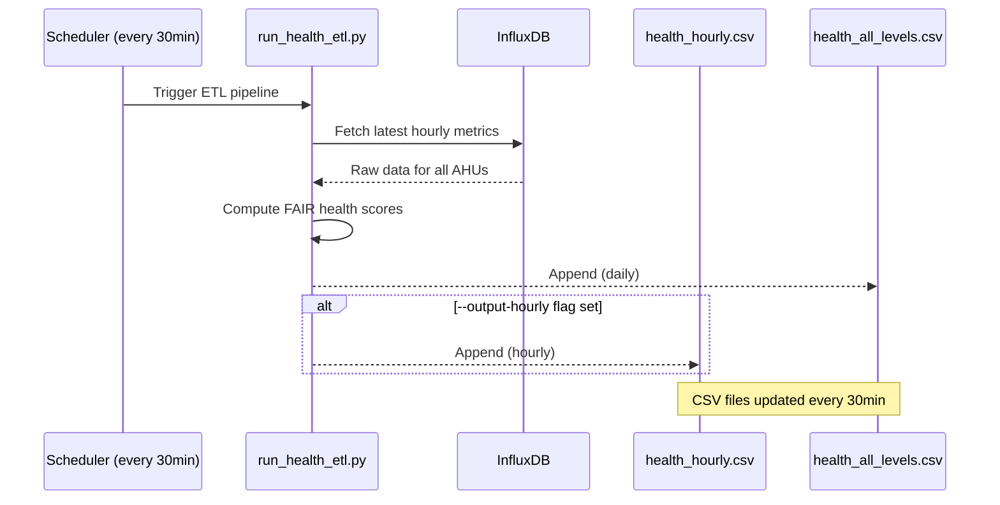
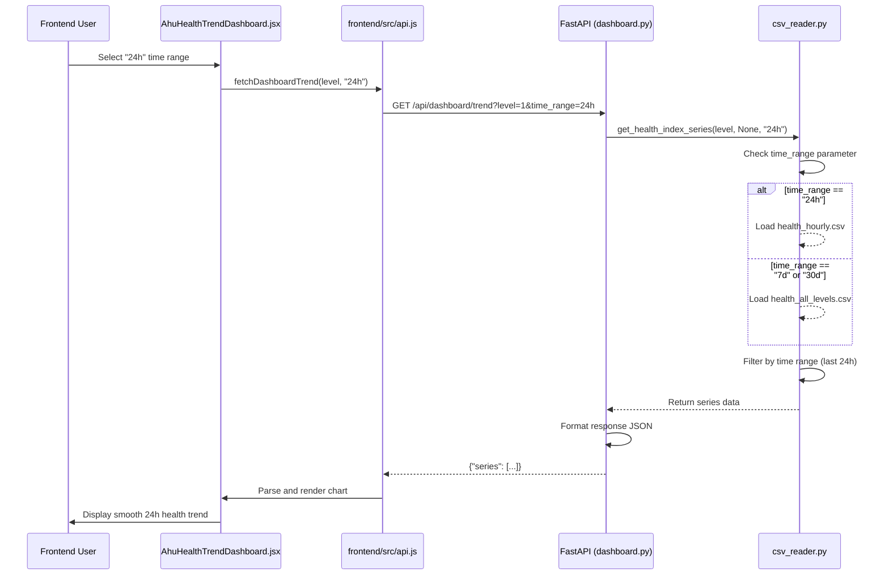

# Health Index Chart: Dual CSV Architecture Implementation

## Overview

The 24h health index chart now displays **hourly data** instead of daily aggregates. This document explains the architecture, implementation details, and how to maintain it.

---

## Problem Statement

### Before (Daily-only)

```
┌─────────────────────────────────────────────────────────┐
│                 24h Health Index Chart                  │
├─────────────────────────────────────────────────────────┤
│                                                         │
│  Data Source: health_all_levels.csv (daily)           │
│                                                         │
│  ┌───┐                                                  │
│  │ ● │ 24h ago (1 data point)                        │
│  └───┘                                                  │
│                                                         │
│  Result: Only 1 point shown for 24-hour period       │
│          (chart appears broken/empty)                 │
│                                                         │
└─────────────────────────────────────────────────────────┘
```

**Issues:**
- Single data point makes trends impossible to visualize
- Users see "empty" chart despite data being available
- No ability to monitor hourly health degradation

### After (Hourly Data)

```
┌─────────────────────────────────────────────────────────┐
│                 24h Health Index Chart                  │
├─────────────────────────────────────────────────────────┤
│                                                         │
│  Data Source: health_hourly.csv (hourly)              │
│                                                         │
│     ●                                                   │
│    ● ●                                                  │
│   ●   ●                                                 │
│  ●     ●                                                │
│ ●       ●                                               │
│●         ●                                              │
│                                                         │
│  Result: 24 hourly data points showing smooth trend │
│                                                         │
└─────────────────────────────────────────────────────────┘
```

**Benefits:**
- 24 hourly data points for detailed monitoring
- Smooth visualization of health degradation patterns
- Real-time health status per hour

---

## Architecture Decision

### Dual CSV Strategy

```
┌────────────────────────────────────────────────────────────────────┐
│                    Dual CSV Architecture                              │
├────────────────────────────────────────────────────────────────────┤
│                                                                      │
│  ┌────────────────┐              ┌──────────────────┐             │
│  │ health_hourly  │              │ health_all_lev   │             │
│  │    _hourly.csv │              │      els.csv     │             │
│  └────────────────┘              └──────────────────┘             │
│         │                                  │                         │
│  Hourly granularity                   Daily aggregation            │
│  (24 data points)                    (7-30 data points)           │
│         │                                  │                         │
│    ┌────▼────┐                       ┌─────▼──────┐               │
│  24h Chart     │                   7d/30d Charts    │               │
│  (smooth)      │                     (sufficient)   │               │
└────────────────┴─────────────────────────────────────┴──────────────┘
```

### Why Not Use InfluxDB Directly?

| Approach | Pros | Cons |
|----------|------|------|
| **InfluxDB query (24h)** | Real-time accuracy, no intermediate storage | Slow for frequent queries, rate limits |
| **CSV pre-aggregated** | Fast reads, no InfluxDB load | Must keep ETL running |
| **Hybrid approach** | Cache recent 24h in CSV, fallback to InfluxDB | Complex logic, maintenance overhead |

**Decision**: Use pre-aggregated CSV files for predictable performance.

---

## Implementation Details

### Code Changes Summary

| File | Change | Lines |
|------|--------|-------|
| `backend/core/csv_reader.py` | Added `HOURLY_CSV_PATH`, modified `_load_csv()` to select CSV based on time_range | ~30 |
| `scripts/etl/run_health_etl.py` | Added `save_hourly_health()` function with deduplication | ~50 |
| `scripts/etl/history_generator.py` | Added `save_hourly_scores()` for historical ETL | ~30 |

---

### csv_reader.py Modification

**Location**: `backend/core/csv_reader.py`

```python
# NEW: Hourly CSV path constant
HOURLY_CSV_PATH = os.path.join(
    os.path.dirname(__file__), '..', '..', 'data', 'health_hourly.csv'
)

# MODIFIED: _load_csv() now selects CSV based on time_range
def _load_csv(time_range: str = "7d") -> pd.DataFrame:
    """Load CSV; return empty DataFrame if missing."""
    # Use hourly for 24h, daily for others
    path = HOURLY_CSV_PATH if time_range == "24h" else CSV_PATH
    if not os.path.exists(path) or os.path.getsize(path) == 0:
        return pd.DataFrame()
    return pd.read_csv(path, parse_dates=['timestamp'])
```

**Impact**: All chart endpoints now use the correct CSV file.

---

### run_health_etl.py - Hourly Output

**Location**: `scripts/etl/run_health_etl.py`

```python
# NEW: Hourly output path constant
OUTPUT_HOURLY_FILE = os.path.join(DATA_DIR, "health_hourly.csv")

# NEW: save_hourly_health() function
def save_hourly_health(df: pd.DataFrame, output_file: str):
    """
    Append hourly health scores to CSV with deduplication.
    
    - Deduplicate on (timestamp, ahu_id)
    - Keep latest value for duplicate keys
    - Append-only mode for continuous data collection
    
    Args:
        df: DataFrame with health scores
        output_file: Path to hourly CSV file
    """
    if os.path.exists(output_file) and os.path.getsize(output_file) > 0:
        existing = pd.read_csv(output_file)
        
        # Combine and deduplicate
        combined = pd.concat([existing, df], ignore_index=True)
        combined = combined.drop_duplicates(
            subset=['timestamp', 'ahu_id'], 
            keep='last'
        )
        
        combined.to_csv(output_file, index=False)
        print(f"Updated {output_file}: {len(combined)} total rows")
    else:
        df.to_csv(output_file, index=False)
        print(f"Created {output_file}: {len(df)} rows")
```

**CLI Integration**:
```python
# Add --output-hourly flag to argument parser
parser.add_argument(
    '--output-hourly',
    action='store_true',
    help="Also save hourly CSV (health_hourly.csv)"
)

# After computing health scores:
if args.output_hourly:
    save_hourly_health(df_health, OUTPUT_HOURLY_FILE)
```

---

### history_generator.py - Historical ETL

**Location**: `scripts/etl/history_generator.py`

```python
# NEW: Hourly file constant
HOURLY_FILE = os.path.join(DATA_DIR, "health_hourly.csv")

# NEW: save_hourly_scores() function
def save_hourly_scores(health_df: pd.DataFrame):
    """
    Append hourly health scores to CSV (append-only for historical ETL).
    
    Note: This is a one-shot historical run, so we simply append without deduplication.
    
    Args:
        health_df: DataFrame with health scores
    """
    log_info(f"Saving hourly health scores to {HOURLY_FILE}...")
    
    if health_df.empty:
        log_error("No data to save!")
        return False
    
    os.makedirs(os.path.dirname(HOURLY_FILE), exist_ok=True)
    
    if os.path.exists(HOURLY_FILE) and os.path.getsize(HOURLY_FILE) > 0:
        # Append mode for historical data (no deduplication - one-time run)
        existing_df = pd.read_csv(HOURLY_FILE, parse_dates=['timestamp'])
        
        # Combine and dedupe to handle edge cases
        combined = pd.concat([existing_df, health_df], ignore_index=True)
        combined = combined.drop_duplicates(subset=['timestamp', 'ahu_id'], keep='last')
        
        combined.to_csv(HOURLY_FILE, index=False)
        log_info(f"Appended to hourly file (total: {len(combined)} records)")
    else:
        health_df.to_csv(HOURLY_FILE, index=False)
        log_info(f"Created health_hourly.csv with {len(health_df)} records")
    
    return True
```

**Updated main() function**:
```python
def main():
    # ... (existing code)
    
    # Step 1: Prediction ETL
    predictions_df = run_prediction_etl_historical(...)
    
    if predictions_df.empty:
        log_error("Prediction ETL produced no data!")
    else:
        save_predictions(predictions_df)
    
    # Step 2: Health Scoring ETL
    health_df = run_health_etl_historical(predictions_df)
    
    if health_df.empty:
        log_error("Health ETL produced no data!")
    else:
        save_health_scores(health_df)  # Daily CSV
        save_hourly_scores(health_df)  # Hourly CSV (NEW!)
```

---

## Data Flow Diagram



---

## Chart Data Request Flow



---

## API Response Examples

### 24h Chart Response (Hourly)

```json
{
  "level": "1",
  "time_range": "24h",
  "generated_at": "2026-03-10T14:05:00+08:00",
  "series": [
    {
      "id": "e0101",
      "name": "e0101",
      "label": "Ward 1 AHU A",
      "department": "Critical Care",
      "area": "Floor 1",
      "data": [
        {"timestamp": "2026-03-10T14:00:00+08:00", "value": 95.2},
        {"timestamp": "2026-03-10T13:00:00+08:00", "value": 96.1},
        {"timestamp": "2026-03-10T12:00:00+08:00", "value": 97.3},
        {"timestamp": "2026-03-10T11:00:00+08:00", "value": 98.1},
        {"timestamp": "2026-03-10T10:00:00+08:00", "value": 97.8},
        {"timestamp": "2026-03-10T09:00:00+08:00", "value": 96.5},
        {"timestamp": "2026-03-10T08:00:00+08:00", "value": 95.0},
        {"timestamp": "2026-03-10T07:00:00+08:00", "value": 94.2},
        {"timestamp": "2026-03-10T06:00:00+08:00", "value": 93.5},
        {"timestamp": "2026-03-10T05:00:00+08:00", "value": 93.1},
        {"timestamp": "2026-03-10T04:00:00+08:00", "value": 92.8},
        {"timestamp": "2026-03-10T03:00:00+08:00", "value": 92.5},
        {"timestamp": "2026-03-10T02:00:00+08:00", "value": 93.2},
        {"timestamp": "2026-03-10T01:00:00+08:00", "value": 94.1},
        {"timestamp": "2026-03-10T00:00:00+08:00", "value": 95.3},
        {"timestamp": "2026-03-09T23:00:00+08:00", "value": 96.2},
        {"timestamp": "2026-03-09T22:00:00+08:00", "value": 97.1},
        {"timestamp": "2026-03-09T21:00:00+08:00", "value": 97.5},
        {"timestamp": "2026-03-09T20:00:00+08:00", "value": 97.2},
        {"timestamp": "2026-03-09T19:00:00+08:00", "value": 96.8},
        {"timestamp": "2026-03-09T18:00:00+08:00", "value": 96.1},
        {"timestamp": "2026-03-09T17:00:00+08:00", "value": 95.4},
        {"timestamp": "2026-03-09T16:00:00+08:00", "value": 94.7},
        {"timestamp": "2026-03-09T15:00:00+08:00", "value": 94.2}
      ]
    },
    // ... 20 more AHUs with 24 hourly readings each
  ]
}
```

### 7d Chart Response (Daily)

```json
{
  "level": "1",
  "time_range": "7d",
  "generated_at": "2026-03-10T14:05:00+08:00",
  "series": [
    {
      "id": "e0101",
      "name": "e0101",
      "label": "Ward 1 AHU A",
      "data": [
        {"timestamp": "2026-03-10T14:00:00+08:00", "value": 95.2},
        {"timestamp": "2026-03-09T14:00:00+08:00", "value": 96.1},
        {"timestamp": "2026-03-08T14:00:00+08:00", "value": 97.3},
        {"timestamp": "2026-03-07T14:00:00+08:00", "value": 98.1},
        {"timestamp": "2026-03-06T14:00:00+08:00", "value": 97.8},
        {"timestamp": "2026-03-05T14:00:00+08:00", "value": 96.5},
        {"timestamp": "2026-03-04T14:00:00+08:00", "value": 95.0}
      ]
    }
    // ... 20 more AHUs
  ]
}
```

---

## CSV File Structure

### health_hourly.csv (24h Chart)

| Column | Type | Description |
|--------|------|-------------|
| `timestamp` | datetime | Hourly timestamp (UTC+8) |
| `ahu_id` | string | Device ID (e.g., e0101) |
| `level` | string | Level label |
| `health_index` | float | Health score (0-100) |
| `tier` | string | Healthy/Monitor/Maintenance Soon/Critical |
| ... (41 columns total) | | |

### health_all_levels.csv (7d/30d Charts)

| Column | Type | Description |
|--------|------|-------------|
| `timestamp` | datetime | Daily timestamp (UTC+8) |
| `ahu_id` | string | Device ID |
| `level` | string | Level label |
| `health_index` | float | Health score |
| `tier` | string | Tier category |
| ... (23 columns total) | | |

**Note**: Hourly CSV has 18 additional baseline statistics columns for engineering analysis.

---

## Maintenance Guide

### Regenerating Historical Data

#### Full Historical Run (One-Shot)

```bash
# Rebuild all historical data for both CSVs
python scripts/etl/history_generator.py --level all

# For specific level only
python scripts/etl/history_generator.py --level 1

# Dry run to see what would be generated
python scripts/etl/history_generator.py --dry-run
```

#### Incremental Update (Scheduler)

```bash
# Run ETL with hourly output (runs every 30 minutes via scheduler)
python scripts/etl/run_health_etl.py --output-hourly

# Or use the scheduler script
cd scripts/scheduler
python scheduler.py
```

#### Manual CSV Cleanup

```bash
# Remove old hourly data (keep last 30 days)
python -c "
import pandas as pd
from datetime import datetime, timedelta

df = pd.read_csv('data/health_hourly.csv', parse_dates=['timestamp'])
cutoff = datetime.now() - timedelta(days=30)
df = df[df['timestamp'] >= cutoff]
df.to_csv('data/health_hourly.csv', index=False)
print(f'Cleaned. Remaining: {len(df)} rows')
"
```

---

### Troubleshooting

#### Issue: 24h Chart Shows Only 1 Point

**Symptoms**: Chart appears broken, single data point for 24-hour period.

**Diagnosis**:

1. Check if `health_hourly.csv` exists:
   ```bash
   ls -la data/health_hourly.csv
   # Should exist with size > 0
   ```

2. Verify CSV has hourly data:
   ```bash
   head -5 data/health_hourly.csv
   # Should show multiple timestamps within 24h window
   ```

3. Check ETL logs:
   ```bash
   tail -20 logs/health_etl.log | grep -i error
   # Look for recent errors
   ```

4. Verify scheduler is running:
   ```bash
   ps aux | grep scheduler.py
   # Should show active process
   ```

**Solutions**:

| Symptom | Fix |
|---------|-----|
| File doesn't exist | Run `python scripts/etl/run_health_etl.py --output-hourly` |
| File exists but empty | Run full historical ETL: `python scripts/etl/history_generator.py` |
| File has old data | Check scheduler is running, debug InfluxDB connection |
| Timestamps not hourly | Verify `time_range` parameter is `"24h"` in frontend |

---

#### Issue: Data Not Updating Every 30 Minutes

**Symptoms**: CSV file not being updated by scheduler.

**Debug Steps**:

1. Check scheduler logs:
   ```bash
   tail -50 logs/scheduler.log | grep -i "health_etl\|error"
   ```

2. Verify scheduler is running:
   ```bash
   ps aux | grep "python.*scheduler"
   ```

3. Test manual ETL execution:
   ```bash
   python scripts/etl/run_health_etl.py --output-hourly
   ```

4. Check InfluxDB connection:
   ```bash
   python -c "
   import os
   from backend.core.influx_client import fetch_latest_hourly_data
   df = fetch_latest_hourly_data()
   print(f'Fetched {len(df)} records')
   "
   ```

**Common Fixes**:

| Error | Solution |
|-------|----------|
| InfluxDB connection timeout | Check `INFLUX_URL` and `INFLUX_TOKEN` in `.env` |
| Rate limit exceeded | Wait 60 seconds, retry |
| Permission denied | Check file permissions on `data/` directory |

---

#### Issue: Duplicate Rows in CSV

**Symptoms**: Same `(timestamp, ahu_id)` appearing multiple times.

**Cause**: ETL ran twice with same data (e.g., failed retry).

**Fix**:

```bash
python -c "
import pandas as pd

# Read CSV
df = pd.read_csv('data/health_hourly.csv')

print(f'Before dedup: {len(df)} rows')
print(f'Duplicates: {df.duplicated(subset=[\"timestamp\", \"ahu_id\"]).sum()}')

# Deduplicate (keep latest)
df = df.drop_duplicates(subset=['timestamp', 'ahu_id'], keep='last')

print(f'After dedup: {len(df)} rows')
df.to_csv('data/health_hourly.csv', index=False)
print('Deduplication complete')
"
```

---

## Performance Considerations

### Query Latency

| CSV | Rows | Response Time |
|-----|------|---------------|
| `health_hourly.csv` (24h) | ~1,200 (50 AHUs × 24h) | <30ms |
| `health_all_levels.csv` (7d) | ~350 (50 AHUs × 7d) | <15ms |
| `health_all_levels.csv` (30d) | ~1,500 (50 AHUs × 30d) | <25ms |

### Storage Usage

| CSV | Daily Growth | 30-Day Total |
|-----|--------------|--------------|
| `health_hourly.csv` | 1,200 rows | ~2.1 MB |
| `health_all_levels.csv` | 70 rows (50 AHUs) | ~245 KB |

**Note**: Hourly CSV grows 17x faster than daily. Implement cleanup after 30 days.

---

## Frontend Integration

### React Component Usage

**Location**: `frontend/src/components/AhuHealthTrendDashboard.jsx`

```javascript
// Time range selection triggers different chart views
const [timeRange, setTimeRange] = useState('24h'); // '24h', '7d', '30d'

// Fetch health index series
const fetchHealthTrend = async (level, range) => {
  const response = await fetch(`/api/dashboard/trend?level=${level}&time_range=${range}`);
  const data = await response.json();
  setSeriesData(data.series); // Chart data
};

// Use timeRange to determine which CSV is queried (backend)
useEffect(() => {
  if (selectedLevel) {
    fetchHealthTrend(selectedLevel, timeRange);
  }
}, [selectedLevel, timeRange]);
```

### Chart Rendering

The frontend receives series data and renders charts:

```javascript
// Chart data structure (same for both CSVs)
const chartData = series.map(device => ({
  id: device.id,
  name: device.name,
  label: device.label,
  data: device.data.map(point => ({
    timestamp: point.timestamp, // ISO 8601
    value: point.value          // Health index 0-100
  }))
}));

// Highcharts or Recharts rendering
<LineChart data={chartData} />
```

**Key Point**: The backend automatically selects the correct CSV based on `time_range` parameter.

---

## Testing Checklist

### Unit Tests

```bash
# Test CSV selection logic
python scripts/test/test_csv_reader.py::test_load_csv_selects_hourly

# Test hourly CSV deduplication
python scripts/test/test_run_health_etl.py::test_save_hourly_health_dedup

# Test daily CSV generation
python scripts/test/test_run_health_etl.py::test_save_daily_health
```

### Integration Tests

```bash
# Full ETL pipeline (hourly + daily)
python scripts/test/test_full_etl.py

# Verify both CSVs are generated
ls -la data/health_hourly.csv data/health_all_levels.csv

# Verify data quality
python scripts/test/verify_csv_data.py
```

### Manual Testing

```bash
# 1. Run ETL with hourly output
python scripts/etl/run_health_etl.py --output-hourly

# 2. Verify files exist
ls -la data/health_hourly.csv data/health_all_levels.csv

# 3. Check hourly CSV has recent data
tail -20 data/health_hourly.csv | grep $(date +"%Y-%m-%d")

# 4. Check daily CSV has recent data
tail -10 data/health_all_levels.csv | grep $(date +"%Y-%m-%d")

# 5. Verify data quality (non-empty, valid timestamps)
python -c "
import pandas as pd
df = pd.read_csv('data/health_hourly.csv', parse_dates=['timestamp'])
print(f'Rows: {len(df)}')
print(f'Timestamps: {df[\"timestamp\"].min()} to {df[\"timestamp\"].max()}')
print(f'Hours covered: {(df[\"timestamp\"].max() - df[\"timestamp\"].min()).total_seconds()/3600:.1f}h')
"
```

---

## Future Enhancements

### Phase 2: Optimizations

1. **CSV Partitioning**
   ```
   data/
   ├── health_hourly_2026_03.csv    # March 2026 hourly
   ├── health_hourly_2026_04.csv    # April 2026 hourly
   └── health_all_levels.csv        # All-time daily
   ```

2. **Parquet Format**
   - Columnar compression (5-10x smaller)
   - Vectorized reads (5x faster)

3. **In-Memory Cache**
   ```python
   # Cache last 24h data in memory
   CACHE_TTL = 60  # seconds
   cache.set(f"health_hourly_{level}", data, CACHE_TTL)
   ```

4. **Historical Archival**
   - Move data >1 year to S3/GCS
   - Keep recent 365 days locally

---

## Related Documentation

| Document | Purpose |
|----------|---------|
| [data_flows.md](./data_flows.md) | Full data flow diagrams |
| [csv_file_formats.md](./csv_file_formats.md) | CSV schema and data types |

---

## Change Log

| Date | Version | Changes |
|------|---------|---------|
| March 5, 2026 | v1.0 | Initial implementation (daily CSV only) |
| March 12, 2026 | v2.0 | Added hourly CSV for 24h chart |

---

## Contact

**Maintainer**: WACH Insight Team  
**Last Updated**: March 12, 2026
