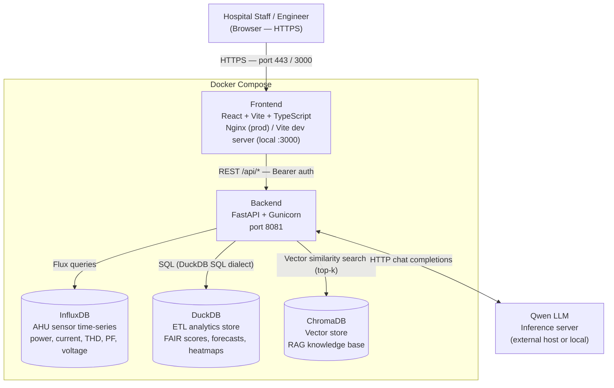

# System Overview

This diagram shows the runtime topology of WACH Insight: how the frontend, backend, and data stores connect, and where the LLM sits relative to the Docker boundary.

## Component Responsibilities

| Component | Technology | Purpose |
|-----------|-----------|---------|
| Frontend | React 18, Vite, TypeScript, Tailwind v3, Zustand | Dashboard UI, level selector, chatbot panel |
| Backend | FastAPI, Python 3.10, Gunicorn | REST API, business logic, LLM orchestration |
| InfluxDB | InfluxDB v2, Flux query language | Raw AHU electrical measurements (time-series) |
| DuckDB | DuckDB (file-backed) | FAIR score computation, forecasts, heatmaps (analytics layer over CSV/parquet) |
| ChromaDB | ChromaDB (embedded) | RAG document embeddings for the chatbot knowledge base |
| Qwen LLM | Qwen (via HTTP) | Chat completions, NL→structured query translation |

## Docker Boundary

In production, all components except the Qwen LLM run inside a single Docker Compose stack. The LLM can be co-located or on a separate host — the backend connects to it via `LLM_BASE_URL` (see `.env.example`).

In local development, the Vite dev server proxies `/api` to `localhost:8081`, so the frontend and backend can run independently without Docker.
