# Health Rankings & Safety Flags Feature

## Overview

This document describes the **Health Rankings and Safety Flags** feature added to the WACH Insight dashboard. This feature provides:

1. **Health Rankings**: Top 5 healthiest and top 5 AHUs needing attention for each building level
2. **Safety Flags**: Automatic detection of critical electrical safety issues per device

### Feature Scope

| Component | Status |
|-----------|--------|
| Backend API Endpoints | ✅ Implemented |
| Frontend Components | ✅ Implemented |
| Safety Flag Detection | ✅ Implemented |
| Documentation | ✅ Complete |

---

## Backend Implementation

### 1. New Constants and Helpers (`risk_engine.py`)

#### SAFETY_FLAGS_DEF Constant

Defined at line ~1589 in `backend/core/risk_engine.py`:

```python
SAFETY_FLAGS_DEF = {
    "THD_CHRONIC_HIGH":   ("composite_thd_24h", ">", 15.0),
    "IMBALANCE_SEVERE":   ("current_unbalance",  ">", 30.0),
    "PF_CHRONIC_LOW":     ("power_factor_avg",   "<",  0.50),
    "OVERLOAD_CHRONIC":   ("power_total",        ">",  None),  # computed separately
}
```

**Purpose**: Defines the threshold definitions for safety flag detection.

#### compute_safety_flags() Helper Function

```python
def compute_safety_flags(metrics: Dict) -> List[str]:
    """
    Evaluate AHU metrics against structural safety thresholds.
    
    Returns list of flag strings for this AHU.
    """
```

**Thresholds Detected**:

| Flag ID | Metric | Threshold | Severity |
|---------|--------|-----------|----------|
| `THD_CHRONIC_HIGH` | composite_thd_24h | > 15.0% | High |
| `IMBALANCE_SEVERE` | current_unbalance | > 30.0% | High |
| `PF_CHRONIC_LOW` | power_factor_avg | < 0.50 | Moderate |
| `OVERLOAD_CHRONIC` | power_total > p95*90% | > 90% of historical p95 | High |

**Logic**:
- **THD**: Compares 24-hour rolling mean against 15% threshold (IEEE 519 limit)
- **Imbalance**: Compares current unbalance against 30% threshold (severe warning)
- **PF**: Checks if power factor drops below 0.50 (inefficient operation)
- **Overload**: Compares current power to 90% of historical p95 ceiling

#### Integration with Assessments

Each assessment in `generate_fleet_risk_assessment()` now includes a `safety_flags` field:

```json
{
  "ahu_id": "wach_e0101",
  "timestamp": "2026-03-10T14:00:00+08:00",
  "health_index": 72.5,
  "health_tier": "Monitor",
  "safety_flags": "THD_CHRONIC_HIGH,PF_CHRONIC_LOW",
  ...
}
```

---

### 2. New API Endpoint (`dashboard.py`)

#### GET /api/dashboard/safety-flags

**Location**: `backend/routes/dashboard.py` lines ~631-725

```python
@router.get("/safety-flags")
async def dashboard_safety_flags(
    level: str = Query(default="1", description="Building level (1-11)"),
    time_range: str = Query(default="last_30d", description="Time period to analyze")
):
```

**Parameters**:

| Param | Type | Default | Description |
|-------|------|---------|-------------|
| level | string | "1" | Building level (1-11) |
| time_range | string | "last_30d" | Time period: last_24h, last_7d, last_30d |

**Response Format**:

```json
{
  "level": "1",
  "time_range": "last_30d",
  "generated_at": "2026-03-10T14:00:00+08:00",
  "safety_flags": [
    {
      "ahu_id": "e0101",
      "flags": [
        {
          "flag_id": "THD_CHRONIC_HIGH",
          "label": "THD Critical",
          "severity": "High",
          "threshold": ">15.0%"
        },
        {
          "flag_id": "PF_CHRONIC_LOW",
          "label": "Low Power Factor",
          "severity": "Moderate",
          "threshold": "<0.50"
        }
      ]
    },
    {
      "ahu_id": "e0102",
      "flags": []
    }
  ]
}
```

**Error Responses**:

| Status | Error | Description |
|--------|-------|-------------|
| 400 | "Level must be between 1 and 11" | Invalid level parameter |
| 400 | "Level must be a valid number" | Non-numeric level |
| 404 | "No devices found for level X" | No AHUs exist for that level |
| 404 | "No health data available" | No assessments generated |

---

### 3. Updated Existing Endpoint

#### GET /api/dashboard/trend

**Modified**: Added `safety_flags` to response (line ~540)

**New Response Field**:

```json
{
  "level": "1",
  "range": "7d",
  "ahus": ["e0101", "e0102", ...],
  "series": [...],
  "latest_snapshot": {
    "e0101": 72.5,
    ...
  },
  "safety_flags": {
    "e0101": [
      {"flag_id": "THD_CHRONIC_HIGH", "label": "THD Critical", "severity": "High"}
    ],
    ...
  }
}
```

**FLAG_LABELS Mapping** (line ~25):

```python
FLAG_LABELS = {
    "THD_CHRONIC_HIGH": "THD Critical",
    "IMBALANCE_SEVERE": "Severe Imbalance",
    "PF_CHRONIC_LOW": "Low Power Factor",
    "OVERLOAD_CHRONIC": "Overload Risk",
}
```

---

## Frontend Implementation

### 1. New Component: SafetyFlagsCombinedCard.tsx

**Location**: `frontend/src/components/dashboard/SafetyFlagsCombinedCard.tsx`

**Purpose**: Displays all safety flags for a single device in Single Device view.

**Props**:
```typescript
interface SafetyFlagsCombinedCardProps {
  deviceId: string;
  deviceName?: string;
  safetyFlags: SafetyFlag[];
}
```

**SafetyFlag Interface**:
```typescript
export interface SafetyFlag {
  flag_id: string;
  label: string;
  severity: 'High' | 'Moderate' | 'Low';
  threshold?: string;
}
```

**Display Features**:
- Per-flag cards with severity color coding
- Flag-specific icons (⚡, ⚖️, 📉, ⚠️)
- Threshold values displayed when available
- Severity badges (Critical/Warning/Info)

**Severity Color Mapping**:

| Severity | Border Color | Background | Text |
|----------|--------------|------------|------|
| High | `#FF4D6A` | Red 5% | `#FF4D6A` |
| Moderate | `#FFB020` | Amber 5% | `#FFB020` |
| Low | `#00E5A0` | Green 5% | `#00E5A0` |

**No Flags State**:
```
✅ No safety flags detected for this device
```

**Flag List Example**:

```
⚡ THD Critical              [Critical]
   Threshold: >15.0%

📉 Low Power Factor          [Warning]
   Threshold: <0.50
```

---

### 2. New Component: HealthRankSection.tsx

**Location**: `frontend/src/components/dashboard/HealthRankSection.tsx`

**Purpose**: Displays Top 5 healthiest and Top 5 needs-attention AHUs when "All AHUs" view is selected.

**Props**:
```typescript
interface HealthRankSectionProps {
  bestDevices: DeviceRank[];   // Top 5 healthiest (highest index)
  worstDevices: DeviceRank[];  // Top 5 unhealthy (lowest index)
}
```

**DeviceRank Interface**:
```typescript
interface DeviceRank {
  ahu_id: string;
  index: number;      // Health index (0-100)
  tier?: string;
  level?: string;
}
```

**Display Structure**:

```
Health Rankings
├── Top 5 Healthiest ✓
│   ├── #1 e0105 94.2 [Healthy]
│   ├── #2 e0101 89.7 [Healthy]
│   └── ...
└── Top 5 Needs Attention ⚠
    ├── #1 e0112 38.5 [Critical]
    └── ...
```

**Health Index Color Coding**:

| Range | Text Color | Badge Background | Label |
|-------|------------|------------------|-------|
| 80-100 | `#00E5A0` (green) | Green 10% | Healthy |
| 60-79 | `#FFB020` (amber) | Amber 10% | Monitor |
| 40-59 | `#FFA500` (orange) | Orange 10% | Maintenance Soon |
| 0-39 | `#FF4D6A` (red) | Red 10% | Critical |

**Card Design**:
- Left: Rank number with gradient background
- Middle: AHU ID + tier badge
- Right: Health index number (0-100 scale)

**Empty State**:
```
No health data available
```

---

### 3. Updated App.tsx

**Imports Added**:
```typescript
import HealthRankSection from './components/dashboard/HealthRankSection';
import SafetyFlagsCombinedCard, { type SafetyFlag } from './components/dashboard/SafetyFlagsCombinedCard';
```

**API Client Imports Added**:
```typescript
import { fetchDashboardRanking, fetchDashboardSafetyFlags } from './api/client';
```

**State Added**:
```typescript
const [rankings, setRankings] = useState<{
  best: Array<{ ahu_id: string; index: number }>;
  worst: Array<{ ahu_id: string; index: number }>;
} | null>(null);

const [safetyFlagsData, setSafetyFlagsData] = useState<
  Record<string, Array<{ flag_id: string; label: string; severity: string }>>
 | null>(null);
```

**Data Fetching** (needs to be added to App.tsx useEffect hooks):

```typescript
// In your data fetching logic:
const rankingData = await fetchDashboardRanking(level, range);
setRankings({
  best: rankingData.best,
  worst: rankingData.worst
});

const safetyFlagsResponse = await fetchDashboardSafetyFlags(level, range);
setSafetyFlagsData(
  safetyFlagsResponse.safety_flags.reduce((acc, item) => {
    acc[item.ahu_id] = item.flags;
    return acc;
  }, {} as Record<string, any>)
);
```

**Render Props**:

```typescript
// For All AHUs view (selectedDevice === 'all'):
<HealthRankSection
  bestDevices={rankings?.best || []}
  worstDevices={rankings?.worst || []}
/>

// For Single Device view:
<SafetyFlagsCombinedCard
  deviceId={selectedDevice}
  deviceName={devices.find(d => d.id === selectedDevice)?.name}
  safetyFlags={safetyFlagsData?.[selectedDevice] || []}
/>
```

---

### 4. Updated client.ts

**New API Functions**:

```typescript
/**
 * GET /api/dashboard/ranking — Top 5 best/worst AHUs by health index
 */
export async function fetchDashboardRanking(
  level: number,
  range: 'last_24h' | 'last_7d' | 'last_30d'
) {
  return apiFetch(`/dashboard/ranking?level=${level}&range=${range}`);
}

/**
 * GET /api/dashboard/safety-flags — Safety flags per device
 */
export async function fetchDashboardSafetyFlags(
  level: number,
  range: 'last_24h' | 'last_7d' | 'last_30d'
) {
  return apiFetch(`/dashboard/safety-flags?level=${level}&range=${range}`);
}
```

**Response Types**:

```typescript
// fetchDashboardRanking response:
{
  level: string;
  time_range: string;
  snapshot_time?: string;
  best: Array<{ ahu_id: string; index: number; tier?: string; level?: string }>;
  worst: Array<{ ahu_id: string; index: number; tier?: string; level?: string }>;
}

// fetchDashboardSafetyFlags response:
{
  level: string;
  time_range: string;
  generated_at?: string;
  safety_flags: Array<{
    ahu_id: string;
    flags: Array<{ flag_id: string; label: string; severity: string; threshold?: string }>;
  }>;
}
```

---

## Safety Flags Thresholds and Meanings

### Flag Detection Logic

#### 1. THD_CHRONIC_HIGH (THD Critical)

**Metric**: `composite_thd_24h` (24-hour rolling mean of THD)

**Threshold**: `> 15.0%`

**Meaning**: 
- Harmonic distortion exceeds IEEE 519 limits
- Risk of transformer overheating, capacitor failure, and relay misoperation

**Action Required**: 
- Investigate non-linear loads on the circuit
- Check for capacitor bank issues
- Consider harmonic filters

---

#### 2. IMBALANCE_SEVERE (Severe Imbalance)

**Metric**: `current_unbalance` (phase current unbalance %)

**Threshold**: `> 30.0%`

**Meaning**:
- Severe three-phase current imbalance
- Indicates potential phase failure or load imbalance

**Action Required**:
- Check for single-phase loading on three-phase system
- Verify motor winding balance
- Investigate load distribution

---

#### 3. PF_CHRONIC_LOW (Low Power Factor)

**Metric**: `power_factor_avg` (average power factor)

**Threshold**: `< 0.50`

**Meaning**:
- Power factor significantly below acceptable levels (typically < 0.85)
- Results in inefficiency and potential utility penalties

**Action Required**:
- Check for undersized motors (running at light load)
- Verify power factor correction capacitor banks
- Investigate variable frequency drive settings

---

#### 4. OVERLOAD_CHRONIC (Overload Risk)

**Metric**: `power_total` vs historical p95

**Threshold**: `> 90% of historical p95`

**Meaning**:
- Current power consumption approaching maximum historical capacity
- Risk of equipment failure or tripping

**Action Required**:
- Review load shedding strategies
- Check for increasing demand trends
- Consider capacity upgrade

---

## Device Selection Logic

### All AHUs vs Single Device Views

The dashboard supports two modes of operation:

#### Mode 1: All AHUs (Fleet View)

**Triggered When**: `selectedDevice === 'all'`

**Components Rendered**:
1. Health Index Chart (all devices)
2. Score Cards Grid (aggregated)
3. **HealthRankSection** (NEW)
4. Combined Scores Chart

**Data Source**: 
- `fetchDashboardRanking(level, range)` - Top 5 best/worst
- Returns rankings sorted by health index

#### Mode 2: Single Device (Device Detail)

**Triggered When**: `selectedDevice !== 'all'` and valid AHU ID

**Components Rendered**:
1. Health Index Chart (single device)
2. Score Cards Grid (single device breakdown)
3. **SafetyFlagsCombinedCard** (NEW)
4. Raw Score Derivation (lazy-loaded)

**Data Source**:
- `fetchDashboardSafetyFlags(level, range)` - Safety flags per device
- Filtered to current device only

---

## API Endpoint Details

### GET /api/dashboard/ranking

**Complete Specification**:

```
GET /api/dashboard/ranking?level=1&range=last_30d
```

**Query Parameters**:
- `level` (required): Building level 1-11
- `range` (optional): `last_24h`, `last_7d`, or `last_30d`

**Response Schema**:

```json
{
  "level": "1",
  "time_range": "last_30d",
  "snapshot_time": "2026-03-10T14:00:00+08:00",
  "best": [
    {
      "ahu_id": "e0105",
      "index": 94.2,
      "tier": "Healthy",
      "level": "Level 1"
    },
    {
      "ahu_id": "e0101",
      "index": 89.7,
      "tier": "Healthy",
      "level": "Level 1"
    }
  ],
  "worst": [
    {
      "ahu_id": "e0112",
      "index": 38.5,
      "tier": "Critical",
      "level": "Level 1"
    },
    {
      "ahu_id": "e0109",
      "index": 42.1,
      "tier": "Maintenance Soon",
      "level": "Level 1"
    }
  ]
}
```

---

### GET /api/dashboard/trend (Updated)

**New Field**: `safety_flags` added to existing response

```json
{
  "level": "1",
  "range": "7d",
  "ahus": ["e0101", "e0102", ...],
  "series": [...],
  "latest_snapshot": {...},
  "safety_flags": {
    "e0101": [
      {"flag_id": "THD_CHRONIC_HIGH", "label": "THD Critical", "severity": "High"}
    ],
    ...
  }
}
```

---

### GET /api/dashboard/safety-flags (NEW)

**Complete Specification**:

```
GET /api/dashboard/safety-flags?level=1&time_range=last_30d
```

**Query Parameters**:
- `level` (required): Building level 1-11
- `time_range` (optional): `last_24h`, `last_7d`, or `last_30d`

**Response Schema**:

```json
{
  "level": "1",
  "time_range": "last_30d",
  "generated_at": "2026-03-10T14:00:00+08:00",
  "safety_flags": [
    {
      "ahu_id": "e0101",
      "flags": [
        {"flag_id": "THD_CHRONIC_HIGH", "label": "THD Critical", "severity": "High", "threshold": ">15.0%"},
        {"flag_id": "PF_CHRONIC_LOW", "label": "Low Power Factor", "severity": "Moderate", "threshold": "<0.50"}
      ]
    },
    {
      "ahu_id": "e0102",
      "flags": []
    }
  ]
}
```

---

## Architecture Diagram

```mermaid
graph TB
    subgraph User[User Interface]
        A[App.tsx] -->|renders for All AHUs| B[HealthRankSection]
        A -->|renders for Single Device| C[SafetyFlagsCombinedCard]
    end

    subgraph API[Frontend API Client]
        B -->|fetchDashboardRanking| D[client.ts]
        C -->|fetchDashboardSafetyFlags| D
    end

    subgraph Backend[FastAPI Server]
        D -->|/api/dashboard/ranking| E[dashboard.py Routes]
        D -->|/api/dashboard/safety-flags| E
    end

    subgraph Engine[Backend Core]
        E -->|generate_fleet_risk_assessment| F[risk_engine.py]
        F -->|compute_safety_flags| G[SAFETY_FLAGS_DEF]
    end

    subgraph Data[InfluxDB]
        G -->|fetch metrics| H[wach_bucket_3]
    end

    style B fill:#00E5A0,stroke:#00E5A0
    style C fill:#FF4D6A,stroke:#FF4D6A
    style E fill:#1E2A3A,stroke:#3B82F6
```



---

## Usage Guide

### Frontend Integration

#### 1. Health Rankings Component (All AHUs View)

```typescript
import HealthRankSection from './components/dashboard/HealthRankSection';

// Fetch data (example)
const rankingData = await fetchDashboardRanking(1, 'last_30d');
setRankings({
  best: rankingData.best,
  worst: rankingData.worst
});

// Render
<HealthRankSection
  bestDevices={rankings?.best || []}
  worstDevices={rankings?.worst || []}
/>
```

#### 2. Safety Flags Component (Single Device View)

```typescript
import SafetyFlagsCombinedCard from './components/dashboard/SafetyFlagsCombinedCard';

// Fetch data (example)
const safetyResponse = await fetchDashboardSafetyFlags(1, 'last_30d');
setSafetyFlagsData(
  safetyResponse.safety_flags.reduce((acc, item) => {
    acc[item.ahu_id] = item.flags;
    return acc;
  }, {} as Record<string, any>)
);

// Render
<SafetyFlagsCombinedCard
  deviceId={selectedDevice}
  deviceName={devices.find(d => d.id === selectedDevice)?.name || ''}
  safetyFlags={safetyFlagsData?.[selectedDevice] || []}
/>
```

---

## Threshold Reference Table

### Safety Flags Overview

| Flag ID | Metric Name | Condition | Severity | Threshold |
|---------|-------------|-----------|----------|-----------|
| `THD_CHRONIC_HIGH` | composite_thd_24h | > 15.0% | High | >15.0% |
| `IMBALANCE_SEVERE` | current_unbalance | > 30.0% | High | >30.0% |
| `PF_CHRONIC_LOW` | power_factor_avg | < 0.50 | Moderate | <0.50 |
| `OVERLOAD_CHRONIC` | power_total / p95 | > 90% | High | >90% of p95 |

### Health Index Tiers

| Tier | Range | Color | Label |
|------|-------|-------|-------|
| Healthy | 80-100 | Green (#00E5A0) | Healthy |
| Monitor | 60-79 | Amber (#FFB020) | Monitor |
| Maintenance Soon | 40-59 | Orange (#FFA500) | Maintenance Soon |
| Critical | 0-39 | Red (#FF4D6A) | Critical |

---

## Files Modified

| File | Changes |
|------|---------|
| `backend/core/risk_engine.py` | Added SAFETY_FLAGS_DEF constant (line ~1589), compute_safety_flags() function (line ~1597), safety_flags field to assessments |
| `backend/routes/dashboard.py` | Added /api/dashboard/safety-flags endpoint (line ~631), added safety_flags to trend response |
| `frontend/src/components/dashboard/SafetyFlagsCombinedCard.tsx` | **NEW** - Displays safety flags for single device |
| `frontend/src/components/dashboard/HealthRankSection.tsx` | **NEW** - Displays Top 5 best/worst AHUs |
| `frontend/src/App.tsx` | Added rank/safetyFlags state, HealthRankSection & SafetyFlagsCombinedCard imports |
| `frontend/src/api/client.ts` | Added fetchDashboardRanking() and fetchDashboardSafetyFlags() functions |

---

## Testing Checklist

### Backend Tests

- [ ] Verify SAFETY_FLAGS_DEF contains all 4 flag types
- [ ] Test compute_safety_flags() with sample metrics
- [ ] Verify /api/dashboard/safety-flags returns correct structure
- [ ] Test error handling for invalid level values
- [ ] Verify /api/dashboard/trend includes safety_flags field

### Frontend Tests

- [ ] HealthRankSection renders with empty data (loading state)
- [ ] HealthRankSection displays Top 5 best devices
- [ ] HealthRankSection displays Top 5 worst devices
- [ ] SafetyFlagsCombinedCard shows "no flags" state
- [ ] SafetyFlagsCombinedCard renders flagged devices with correct colors
- [ ] Severity badges display correct labels (Critical/Warning/Info)
- [ ] Threshold values displayed when available
- [ ] Device selection toggles between views correctly

### Integration Tests

- [ ] All AHUs view shows HealthRankSection
- [ ] Single Device view shows SafetyFlagsCombinedCard
- [ ] Data consistency between ranking and safety flags
- [ ] Time range selector updates both components correctly

---

## Known Limitations

1. **Threshold Values**: Safety flag thresholds are fixed and may need tuning based on facility characteristics
2. **Response Time**: For large levels (11+), safety flags endpoint may take several seconds
3. **Historical Data**: OVERLOAD flag requires p95 calculation, may be inaccurate with limited history

---

## Future Enhancements

1. **Configurable Thresholds**: Allow admin to adjust threshold values per facility
2. **Flag History**: Track flag changes over time (flag emergence/dismissal)
3. **Priority Ordering**: Sort flags by severity/priority
4. **Actionable Recommendations**: Add recommended actions per flag type
5. **Auto-Resolution**: Automatically clear flags when metrics improve

---

## Related Documentation

- [FAIR Health Scoring](../scoring/FAIR_HEALTH_SCORING_DOCUMENTATION.md)
- [Backend Implementation Guide](./BACKEND_IMPLEMENTATION_GUIDE.md)
- [Dashboard Scoring Fix](./DASHBOARD_SCORING_FIX.md)

---

**Last Updated**: March 11, 2026  
**Feature Version**: 1.0  
**Status**: ✅ Complete
