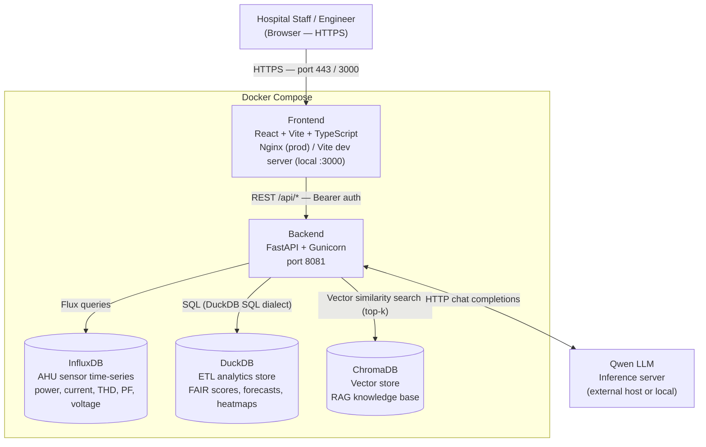
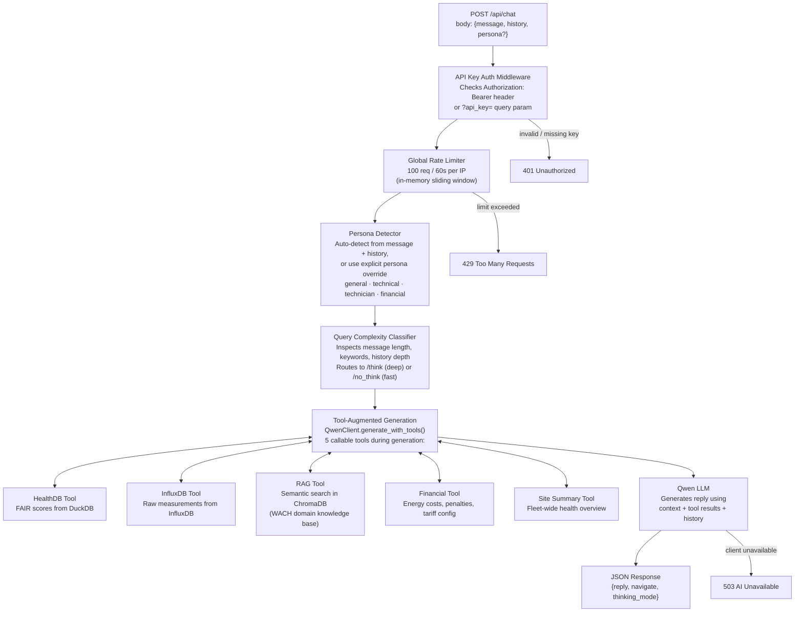

# Phase 5 — Layered Documentation Implementation Plan

> **For agentic workers:** REQUIRED SUB-SKILL: Use superpowers:subagent-driven-development (recommended) or superpowers:executing-plans to implement this plan task-by-task. Steps use checkbox (`- [ ]`) syntax for tracking.

**Goal:** Produce six audience-targeted documentation artefacts (user guide, developer guide, API reference, two architecture diagrams, changelog) and update `README.md` to serve as a documentation hub linking all of them.

**Architecture:** Pure documentation — no backend or frontend code changes. All deliverables are Markdown. Architecture diagrams use Mermaid DSL embedded in `.md` files (GitHub renders Mermaid natively). PNG exports are generated using `npx @mermaid-js/mermaid-cli` as a one-liner. The canonical API reference lives at `docs/api-reference.md`; the legacy `API.md` at root gets a deprecation notice and is retained until a full deprecation period.

**Tech Stack:** Markdown, Mermaid DSL, Keep a Changelog format, `@mermaid-js/mermaid-cli` (optional, for PNG generation)

---

## File Structure

| Action | Path | Responsibility |
|--------|------|----------------|
| Create | `CHANGELOG.md` | Machine-readable project history in Keep a Changelog format |
| Create | `docs/architecture/system-overview.md` | Mermaid diagram — Frontend → Backend → InfluxDB / DuckDB / ChromaDB / Qwen |
| Create | `docs/architecture/chat-pipeline.md` | Mermaid diagram — request lifecycle through auth → persona → tools → LLM → response |
| Create | `docs/user-guide.md` | Hospital staff guide — no code, plain language |
| Create | `docs/api-reference.md` | Comprehensive API reference for all 22 endpoints (replaces root `API.md`) |
| Create | `docs/developer-guide.md` | Engineering onboarding, project structure, contribution workflow |
| Modify | `README.md` | Add "Documentation" hub section with links to all six artefacts above |
| Modify | `API.md` | Add deprecation notice at top pointing to `docs/api-reference.md` |

---

## Task 1: CHANGELOG.md

**Files:**
- Create: `CHANGELOG.md`

- [ ] **Step 1: Run git log to get real dates for historical entries**

```bash
git log --oneline --format="%h %as %s" | head -40
```

Note the dates returned — use them to populate the historical sections below. The dates in Step 2 are placeholders based on memory; replace them with dates from the git output.

- [ ] **Step 2: Create CHANGELOG.md with Keep a Changelog format**

Create `/Users/rdmasia/wach-insight/CHANGELOG.md` with this content (adjust dates from Step 1):

```markdown
# Changelog

All notable changes to this project will be documented in this file.

The format is based on [Keep a Changelog](https://keepachangelog.com/en/1.0.0/).

## [Unreleased]

## [1.5.0] — 2026-04-08

### Added
- User guide for hospital staff (`docs/user-guide.md`)
- Developer guide for engineers (`docs/developer-guide.md`)
- Comprehensive API reference covering all 22 endpoints (`docs/api-reference.md`)
- System overview architecture diagram (`docs/architecture/system-overview.md`)
- Chat pipeline architecture diagram (`docs/architecture/chat-pipeline.md`)
- `README.md` documentation hub with links to all layered docs

## [1.4.0] — 2026-04-02

### Added
- All-time range support across health, scores, measurements, and summary endpoints
- Zustand state management for chat messages; fixed ID generation and removed unused props
- RDM-Atlas chatbot rename with sidebar/fullscreen toggle modes

### Changed
- `useEffect` dependencies fixed in DeepDive; extracted metric hook and chart config

## [1.3.0] — 2026-03-30

### Added
- Agentic chatbot V2: tool-augmented generation with 5 tools (HealthDB, InfluxDB, RAG, financial, site_summary)
- Persona detection: auto-classifies queries as general / technical / technician / financial
- ChromaDB RAG knowledge base for WACH domain documents
- Query complexity routing: `/think` vs `/no_think` prefix for Qwen inference

## [1.2.0] — 2026-03-10

### Added
- Full dark luxury UI redesign: `#0B0F14` background, `#00E5A0` teal-green accent
- Plus Jakarta Sans / DM Sans / JetBrains Mono font stack
- Single-page scroll layout: WelcomeHero → DashboardGate → LevelSelectorBar → Dashboard
- ScoreDerivationSection lazy-loaded (code-split)

### Fixed
- CSS import order: `@import url(...)` must precede `@tailwind` directives
- `index.css` was not imported in `main.tsx`
- Tailwind v3 requires `postcss.config.cjs` (project is ESM)
- LevelSelectorBar: used Zustand store directly instead of missing props

## [1.1.0] — 2026-01-01

### Added
- FAIR health scoring model: Frequency, Amplitude, Imbalance, Resilience (0–100, four tiers)
- DuckDB-backed ETL pipeline for FAIR score computation and analytics
- Financial impact module: excess energy costs, power factor penalties, demand charges
- XGBoost 24-hour power forecast for devices e0202, e0207, e0211
- Delta-forecast endpoint: 23-hour energy delta prediction from historical anchor points
- Prompt injection hardening: 17-pattern regex scan on all LLM-bound inputs
- Structured query allowlist validation: all NL→InfluxDB translations validated before execution
- Per-IP rate limiting: 20 req/60s on `/api/query`, 100 req/60s globally
- API key authentication middleware on all endpoints except `/health`

## [1.0.0] — 2025-09-01

### Added
- Initial release: FastAPI backend + React + Vite + TypeScript + Tailwind frontend
- InfluxDB time-series integration for AHU electrical data (11 levels, ~120 AHU devices)
- Dashboard: health index trend charts and AHU ranking per level
- Basic chatbot with preset prompts
- Docker Compose deployment with Gunicorn + Nginx
```

- [ ] **Step 3: Verify the file renders correctly**

```bash
cat CHANGELOG.md | head -20
```

Expected: see `# Changelog` header and `## [Unreleased]` section.

- [ ] **Step 4: Commit**

```bash
git add CHANGELOG.md
git commit -m "docs: add CHANGELOG.md in Keep a Changelog format"
```

---

## Task 2: System Overview Architecture Diagram

**Files:**
- Create: `docs/architecture/system-overview.md`

- [ ] **Step 1: Create system overview diagram**

Create `/Users/rdmasia/wach-insight/docs/architecture/system-overview.md`:

```markdown
# System Overview

This diagram shows the runtime topology of WACH Insight: how the frontend, backend, and data stores connect, and where the LLM sits relative to the Docker boundary.



## Component Responsibilities

| Component | Technology | Purpose |
|-----------|-----------|---------|
| Frontend | React 18, Vite, TypeScript, Tailwind v3, Zustand | Dashboard UI, level selector, chatbot panel |
| Backend | FastAPI, Python 3.10, Gunicorn | REST API, business logic, LLM orchestration |
| InfluxDB | InfluxDB v2, Flux query language | Raw AHU electrical measurements (time-series) |
| DuckDB | DuckDB (file-backed) | FAIR score computation, forecasts, heatmaps (analytics layer over CSV/parquet) |
| ChromaDB | ChromaDB (embedded) | RAG document embeddings for the chatbot knowledge base |
| Qwen LLM | Qwen (via HTTP) | Chat completions, NL→structured query translation |

## Docker Boundary

In production, all components except the Qwen LLM run inside a single Docker Compose stack. The LLM can be co-located or on a separate host — the backend connects to it via `LLM_BASE_URL` (see `.env.example`).

In local development, the Vite dev server proxies `/api` to `localhost:8081`, so the frontend and backend can run independently without Docker.
```

(Note: the triple backtick fence for the mermaid block is inside the markdown — ensure the outer file fence doesn't close the inner mermaid block. In the actual file, the mermaid block uses its own triple backticks.)

- [ ] **Step 2: Verify file was written correctly**

```bash
head -5 docs/architecture/system-overview.md
```

Expected: `# System Overview`

- [ ] **Step 3: Commit**

```bash
git add docs/architecture/system-overview.md
git commit -m "docs: add system overview architecture diagram (Mermaid)"
```

---

## Task 3: Chat Pipeline Architecture Diagram

**Files:**
- Create: `docs/architecture/chat-pipeline.md`

- [ ] **Step 1: Create chat pipeline diagram**

Create `/Users/rdmasia/wach-insight/docs/architecture/chat-pipeline.md`:

````markdown
# Chat Pipeline

This diagram traces a single `POST /api/chat` request from the browser through every processing layer to the final JSON response.



## Key Design Decisions

**Persona detection is automatic.** The system reads the message and conversation history to select a persona. Explicit `persona` overrides are honoured. The selected persona changes the system prompt and available tools.

**Tool calls happen inside the LLM generation loop.** Qwen can invoke any of the five tools zero or more times before producing its final reply. Results from each tool call are appended to the context window before the next generation step.

**Thinking mode is a prefix, not a separate model.** The `QC` step prepends `/think` or `/no_think` to the user message before it reaches the LLM. This controls Qwen's internal reasoning chain depth.

**No per-endpoint rate limiter.** Unlike `POST /api/query`, the `/api/chat` endpoint relies solely on the global 100 req/60s middleware in `main.py`. If you need tighter per-session limits, add a `SlowAPI` limiter to `routes/chat.py`.

## Related Components

| File | Role |
|------|------|
| `backend/routes/chat.py` | FastAPI route handler — entry point |
| `backend/core/persona_detector.py` | Persona auto-detection logic |
| `backend/core/query_classifier.py` | Complexity routing logic |
| `backend/ai/qwen_client.py` | LLM client with tool call loop |
| `backend/tools/` | Individual tool implementations |
| `backend/middleware/` | Auth and rate limiting middleware |
````

- [ ] **Step 2: Verify file was written**

```bash
head -5 docs/architecture/chat-pipeline.md
```

Expected: `# Chat Pipeline`

- [ ] **Step 3: Commit**

```bash
git add docs/architecture/chat-pipeline.md
git commit -m "docs: add chat pipeline architecture diagram (Mermaid)"
```

---

## Task 4: User Guide

**Files:**
- Create: `docs/user-guide.md`

Audience: hospital ward staff, ward managers, non-technical users. No code. Plain language.

- [ ] **Step 1: Create the user guide**

Create `/Users/rdmasia/wach-insight/docs/user-guide.md` with the following content:

```markdown
# WACH Insight — User Guide

WACH Insight is a web dashboard that monitors the electrical health of the Air Handling Units (AHUs) in your ward. It shows you which units are running well, which need attention, and lets you ask plain-language questions to get more detail.

---

## Opening the Dashboard

1. Open a web browser and navigate to the WACH Insight URL provided by your IT team.
2. If prompted, enter the access code or API key your administrator gave you.
3. You will land on the main dashboard. Use the level selector bar at the top to switch between building levels (1–11).

---

## Understanding the Health Scores

Each AHU receives a **FAIR Health Score** — a number from 0 to 100 that summarises how well the unit is running electrically. Higher is better.

| Score range | Tier | What it means |
|-------------|------|---------------|
| 80 – 100 | **Healthy** | Unit is running normally. No action needed. |
| 60 – 79 | **Monitor** | Minor deviation detected. Worth keeping an eye on. |
| 40 – 59 | **Maintenance** | Degraded performance. Schedule a maintenance visit. |
| 0 – 39 | **Critical** | Significant fault detected. Escalate to facilities. |

FAIR stands for the four electrical dimensions the score measures:

- **F — Frequency anomaly:** unusual variations in supply frequency
- **A — Amplitude anomaly:** energy consumption deviating from expected patterns
- **I — Imbalance:** voltage or current imbalance across the three phases
- **R — Resilience:** power factor and overload indicators

---

## Reading the Dashboard

**Top panel — Level summary:** Shows the average health score for all AHUs on the selected level, along with a trend line for the past 7 days.

**Ranking cards:** The five healthiest and five most in-need-of-attention AHUs on the level, updated every refresh.

**Safety flags:** Persistent electrical issues that have been active for more than 72 hours:
- *THD Critical* — total harmonic distortion consistently above safe limits
- *Severe Imbalance* — phase imbalance exceeding safety thresholds
- *Power Factor Low* — sustained low power factor (increases energy cost)
- *Overload Chronic* — recurring overload on the unit

---

## Using the Chatbot

Click the chat icon (bottom right) to open the assistant. You can type questions in plain English. The assistant understands four types of question:

### General questions
Ask about the dashboard, what scores mean, or what is happening overall.

> *"Which AHUs on level 3 need attention this week?"*  
> *"What does a health score of 45 mean for unit e0512?"*  
> *"Show me the health trend for the past month on level 7."*

### Technical questions
For engineers who want raw data and diagnostic detail.

> *"What is the THD reading for e0202 over the last 48 hours?"*  
> *"Show the power factor trend for all level 5 units in the last 30 days."*  
> *"Which units had energy anomalies above 0.05 this week?"*

### Maintenance questions
For technicians planning or following up on site visits.

> *"Which units on level 2 have had safety flags active for more than a week?"*  
> *"Give me a maintenance summary for e0311 — what issues have been recurring?"*  
> *"Are there any overload warnings on level 9 right now?"*

### Financial questions
For ward managers concerned with energy costs.

> *"What is the estimated excess energy cost from units in the Critical tier this month?"*  
> *"Which level has the highest power factor penalty charges?"*  
> *"Show the financial impact summary for the whole site."*

---

## When Something Looks Wrong

If a unit drops to **Critical** (score below 40) or a new safety flag appears, the dashboard highlights it in red. You do not need to act immediately on every amber flag, but a Critical score warrants escalation.

**Who to contact:**
- Facilities / BMS team: for units in the Critical tier or overload flags
- IT / WACH Insight administrator: if the dashboard itself is unavailable or showing errors
- Your ward manager: for financial impact questions or budget concerns

If the dashboard shows an error message (e.g. "Service unavailable"), please note the time and contact your IT administrator.
```

- [ ] **Step 2: Verify the file renders correctly**

```bash
head -10 docs/user-guide.md
```

Expected: `# WACH Insight — User Guide`

- [ ] **Step 3: Commit**

```bash
git add docs/user-guide.md
git commit -m "docs: add user guide for hospital staff"
```

---

## Task 5: API Reference

**Files:**
- Create: `docs/api-reference.md`
- Modify: `API.md` (deprecation notice)

This document supersedes `API.md`. It covers all 22 registered endpoints, including the 8 missing from the original file.

- [ ] **Step 1: Create the API reference**

Create `/Users/rdmasia/wach-insight/docs/api-reference.md`:

```markdown
# WACH Insight — API Reference

**Base URL:** `https://<your-host>/api`  
**Local development:** `http://localhost:8081/api`

This document covers all endpoints. For a machine-readable spec, visit `/docs` (Swagger UI) or `/openapi.json`.

---

## Authentication

All endpoints except `/health`, `/docs`, `/redoc`, and `/openapi.json` require an API key.

**Header:**
```
Authorization: Bearer <api_key>
```

**Query param (alternative):**
```
?api_key=<api_key>
```

Missing or invalid key → `401 Unauthorized`.

---

## Rate Limiting

| Scope | Limit |
|-------|-------|
| Global (all endpoints) | 100 requests / 60 seconds per IP |
| `POST /api/query` (additional) | 20 requests / 60 seconds per IP |

Exceeded limit → `429 Too Many Requests`.

---

## Common Error Shape

```json
{
  "detail": {
    "error": "Human-readable description",
    "suggestion": "What to do next"
  }
}
```

---

## Health

### GET `/health`

No authentication required. Used by load balancers and uptime monitors.

**Response:**
```json
{ "status": "ok" }
```

---

## Chat

### POST `/api/chat`

Conversational AI endpoint. Uses tool-augmented generation with persona detection.

**Request body:**
```json
{
  "message": "Which AHUs on level 3 are underperforming?",
  "history": [
    { "role": "user", "content": "What is a FAIR score?" },
    { "role": "assistant", "content": "A FAIR score is..." }
  ],
  "context": {},
  "persona": "general"
}
```

| Field | Type | Required | Description |
|-------|------|----------|-------------|
| `message` | string (max 1000 chars) | Yes | User message |
| `history` | array of `{role, content}` | No | Prior conversation turns |
| `context` | object | No | Arbitrary extra context |
| `persona` | `general \| technical \| technician \| financial` | No | Override auto-detection |

**Response:**
```json
{
  "reply": "Level 3 has three AHUs with scores below 60...",
  "navigate": null,
  "thinking_mode": "think"
}
```

**Errors:** `503` if the LLM is unavailable.

**Example:**
```bash
curl -X POST https://<host>/api/chat \
  -H "Authorization: Bearer $API_KEY" \
  -H "Content-Type: application/json" \
  -d '{"message": "Which units on level 5 need attention?"}'
```

---

## Structured Query

### POST `/api/query`

Translates a natural-language query into a structured InfluxDB query, executes it, and returns the result. Unlike `/api/chat`, this endpoint is for programmatic integrations that need structured data rather than a conversational reply.

**Additional rate limit:** 20 requests / 60 seconds per IP (on top of the global 100/60s limit).

**Request body:**
```json
{ "user_query": "Show power factor for e0101 last 7 days", "session_id": "uuid-optional" }
```

| Field | Type | Required | Description |
|-------|------|----------|-------------|
| `user_query` | string (max 400 chars) | Yes | Natural-language query |
| `session_id` | UUID string | No | Session tracking |

**Response:**
```json
{
  "query_type": "time_series",
  "metric": "pf_degradation",
  "device_ids": ["e0101"],
  "time_range": "last_7d",
  "top_n": null,
  "chart": { "labels": [...], "datasets": [...] },
  "summary": "Power factor for e0101 over the last 7 days averaged 0.87.",
  "csv_available": true
}
```

**Errors:**
- `400` — prompt injection detected or input validation failed
- `422` — LLM could not parse the query into a structured form
- `429` — per-endpoint rate limit exceeded
- `502` — InfluxDB query failed

**Example:**
```bash
curl -X POST https://<host>/api/query \
  -H "Authorization: Bearer $API_KEY" \
  -H "Content-Type: application/json" \
  -d '{"user_query": "Show THD for e0202 last 30 days"}'
```

---

## Levels & Devices

### GET `/api/levels`

Returns the list of all building levels.

**Response:**
```json
{ "levels": [1, 2, 3, 4, 5, 6, 7, 8, 9, 10, 11] }
```

**Example:**
```bash
curl https://<host>/api/levels -H "Authorization: Bearer $API_KEY"
```

---

### GET `/api/level/{level_id}/devices`

Returns the list of AHU device IDs on a given level. Reads from static configuration — always available regardless of database state.

**Path params:** `level_id` (int, 1–11)

**Response:**
```json
{ "level": 3, "devices": ["e0301", "e0302", "e0303"] }
```

**Errors:** `404` if level_id is out of range.

**Example:**
```bash
curl https://<host>/api/level/3/devices -H "Authorization: Bearer $API_KEY"
```

---

### GET `/api/level/{level_id}/scores`

FAIR score breakdown per AHU on a level, aggregated over the requested time range.

**Path params:** `level_id` (int, 1–11)  
**Query params:** `time_range` (string, default `7d`) — `24h | 7d | 30d | all`

**Response:**
```json
{
  "level": 3,
  "time_range": "7d",
  "devices": [
    {
      "device_id": "e0301",
      "health_index": 87.3,
      "energy_anomaly": 0.001,
      "pf_degradation": 0.002,
      "phase_imbalance": 0.0,
      "thd_drift": 0.003,
      "overload": 0.0,
      "tier": "Healthy"
    }
  ]
}
```

**Example:**
```bash
curl "https://<host>/api/level/3/scores?time_range=30d" -H "Authorization: Bearer $API_KEY"
```

---

### GET `/api/level/{level_id}/health-index`

Health index time-series for all AHUs on a level (or a single device if filtered).

**Path params:** `level_id` (int, 1–11)  
**Query params:**
- `time_range` (string, default `7d`) — `24h | 7d | 30d | all`
- `device_id` (string, optional) — filter to a single AHU

**Response:**
```json
{
  "level": 3,
  "time_range": "7d",
  "series": [
    { "timestamp": "2026-04-01T00:00:00Z", "device_id": "e0301", "health_index": 87.3 }
  ]
}
```

**Example:**
```bash
curl "https://<host>/api/level/3/health-index?time_range=7d&device_id=e0301" \
  -H "Authorization: Bearer $API_KEY"
```

---

## Dashboard

### GET `/api/dashboard/ranking`

Top 5 healthiest and top 5 lowest-scoring AHUs on a level for the given time range.

**Query params:**
- `level` (string, default `"1"`) — 1–11
- `time_range` (string, default `"last_30d"`) — `last_24h | last_7d | last_30d | all_time`

**Response:**
```json
{
  "level": "3",
  "time_range": "last_30d",
  "snapshot_time": "2026-04-08T10:00:00Z",
  "best": [
    { "device_id": "e0301", "index": 94.2, "tier": "Healthy", "level": "Level 3" }
  ],
  "worst": [
    { "device_id": "e0312", "index": 41.0, "tier": "At Risk", "level": "Level 3" }
  ]
}
```

**Example:**
```bash
curl "https://<host>/api/dashboard/ranking?level=3&time_range=last_7d" \
  -H "Authorization: Bearer $API_KEY"
```

---

### GET `/api/dashboard/trend`

Health index time-series and FAIR component scores per AHU for a level. Also includes active safety flags.

**Query params:**
- `level` (string, default `"1"`) — 1–11
- `range` (string, default `"7d"`) — `24h | 7d | 30d | all`

**Response:**
```json
{
  "level": "1",
  "range": "7d",
  "ahus": ["e0101", "e0102"],
  "series": [
    {
      "timestamp": "2026-04-01T00:00:00Z",
      "device_id": "e0101",
      "health_index": 87.3,
      "energy_anomaly": 0.0012,
      "pf_degradation": 0.0034,
      "phase_imbalance": 0.0001,
      "thd_drift": 0.0056,
      "overload": 0.0
    }
  ],
  "latest_snapshot": { "e0101": 87.3 },
  "safety_flags": {
    "e0101": [{ "flag_id": "THD_CHRONIC_HIGH", "label": "THD Critical", "severity": "High" }]
  }
}
```

**Example:**
```bash
curl "https://<host>/api/dashboard/trend?level=1&range=30d" -H "Authorization: Bearer $API_KEY"
```

---

### GET `/api/dashboard/trend/csv`

Same data as `/api/dashboard/trend` but returns the time-series as an embedded CSV string. Useful for exporting to spreadsheets.

**Query params:** Same as `/api/dashboard/trend` (`level`, `range`).

**Response:**
```json
{
  "level": "1",
  "range": "7d",
  "column_names": ["timestamp","device_id","health_index","energy_anomaly","pf_degradation","phase_imbalance","thd_drift","overload"],
  "row_count": 42,
  "csv_content": "timestamp,device_id,health_index,...\n2026-04-01T00:00:00Z,e0101,87.3,..."
}
```

**Note:** The response is JSON, not `text/csv`. Parse `csv_content` for the spreadsheet data.

**Example:**
```bash
curl "https://<host>/api/dashboard/trend/csv?level=1&range=7d" -H "Authorization: Bearer $API_KEY"
```

---

### GET `/api/dashboard/summary`

LLM-generated narrative summaries for each FAIR dimension on a level. Only level 1 returns AI-generated text; all other levels return static fallback strings.

**Query params:**
- `level` (string, default `"1"`) — 1–11
- `range` (string, default `"7d"`) — `24h | 7d | 30d | all`
- `ahu_id` (string, optional) — accepted and echoed back; per-device filtering is not yet implemented

**Response:**
```json
{
  "level": "1",
  "range": "7d",
  "device_id": null,
  "summaries": {
    "energy_anomaly": { "title": "Energy Anomaly", "summary": "Level 1 AHUs showed a 12% spike in energy anomaly on Wednesday..." },
    "pf_degradation": { "title": "Power Factor Degradation", "summary": "..." },
    "phase_imbalance": { "title": "Phase Imbalance", "summary": "..." },
    "thd_drift":       { "title": "THD Drift", "summary": "..." },
    "overload":        { "title": "Overload", "summary": "..." }
  }
}
```

**Example:**
```bash
curl "https://<host>/api/dashboard/summary?level=1&range=7d" -H "Authorization: Bearer $API_KEY"
```

---

### GET `/api/dashboard/safety-flags`

Safety flags that have been persistently active on a level over the requested time range.

**Query params:**
- `level` (string, default `"1"`) — 1–11
- `time_range` (string, default `"last_30d"`) — `last_24h | last_7d | last_30d`

**Flag IDs and severities:**

| Flag ID | Severity | Meaning |
|---------|----------|---------|
| `THD_CHRONIC_HIGH` | High | Total harmonic distortion consistently above 15% |
| `IMBALANCE_SEVERE` | High | Phase imbalance exceeding safety threshold |
| `PF_CHRONIC_LOW` | Moderate | Sustained low power factor (increases energy cost) |
| `OVERLOAD_CHRONIC` | High | Recurring overload on the unit |

**Response:**
```json
{
  "level": "1",
  "time_range": "last_30d",
  "generated_at": "2026-04-08T10:00:00Z",
  "safety_flags": [
    {
      "device_id": "e0101",
      "flags": [
        { "flag_id": "THD_CHRONIC_HIGH", "label": "THD Critical", "severity": "High", "threshold": ">15.0%" }
      ]
    }
  ]
}
```

Devices with no active flags are omitted.

**Example:**
```bash
curl "https://<host>/api/dashboard/safety-flags?level=1&time_range=last_7d" \
  -H "Authorization: Bearer $API_KEY"
```

---

### GET `/api/dashboard/ahu-heatmap`

Hourly average health and FAIR scores for a single AHU, broken down by hour of day (0–23). Useful for identifying recurring patterns at specific times.

**Query params:**
- `ahu_id` (string, **required**) — e.g. `e0101`
- `range` (string, default `"7d"`) — `24h | 7d | 30d | all`

**Response:**
```json
{
  "ahu_id": "e0101",
  "range": "7d",
  "hours": [
    {
      "hour": 0,
      "avg_health": 87.2,
      "scores": {
        "energy_anomaly": 0.001,
        "pf_degradation": 0.002,
        "phase_imbalance": 0.0,
        "thd_drift": 0.003,
        "overload": 0.0
      }
    }
  ]
}
```

Array always has 24 entries (hour 0–23). `avg_health` and score values are `null` for hours with no data.

**Example:**
```bash
curl "https://<host>/api/dashboard/ahu-heatmap?ahu_id=e0101&range=30d" \
  -H "Authorization: Bearer $API_KEY"
```

---

## Device-Level Endpoints

### GET `/api/device/{device_id}/raw-score-relationship`

Raw sensor measurements mapped against the computed FAIR score for a single device. Used to understand which sensor readings are driving health score changes.

**Path params:** `device_id` — must match pattern `e\d{4}` and be in the allowed device list  
**Query params:** `range` (string, default `"7d"`) — `24h | 7d | 30d | all`

**Response:** time-series of `{timestamp, raw_value, score}` pairs per FAIR dimension.

**Errors:** `404` if device_id is not in the allowed list or doesn't match `e\d{4}`.

**Example:**
```bash
curl "https://<host>/api/device/e0101/raw-score-relationship?range=7d" \
  -H "Authorization: Bearer $API_KEY"
```

---

### GET `/api/device/{device_id}/measurements`

Arbitrary metric time-series from InfluxDB for a device. Use this when you need the raw sensor data rather than derived FAIR scores.

**Path params:** `device_id` — `e\d{4}` format  
**Query params:** `metric` (string), `time_range` (string, default `7d`)

**Example:**
```bash
curl "https://<host>/api/device/e0101/measurements?metric=power_total&time_range=24h" \
  -H "Authorization: Bearer $API_KEY"
```

---

### GET `/api/device/{device_id}/delta-forecast`

23-hour forward forecast of energy delta (kWh change per hour) using historical anchor points at -1 day, -7 days, and -14 days.

**Path params:** `device_id` — must be one of the supported forecast devices: `e0202`, `e0207`, `e0211`, or other devices in `ALLOWED_DEVICES`.

**Response:**
```json
{
  "device_id": "e0202",
  "generated_at": "2026-04-08T10:00:00Z",
  "t_now": "2026-04-08T10:00:00Z",
  "forecast": [
    { "hour": 1, "target_time": "2026-04-08T11:00:00Z", "predicted_delta_kwh": 0.1234 },
    { "hour": 2, "target_time": "2026-04-08T12:00:00Z", "predicted_delta_kwh": null }
  ]
}
```

`predicted_delta_kwh` is `null` when all three historical anchors are missing or negative (meter resets). Always 23 entries.

**Example:**
```bash
curl https://<host>/api/device/e0202/delta-forecast -H "Authorization: Bearer $API_KEY"
```

---

## Forecasting

### GET `/api/forecast/{device_id}`

24-hour XGBoost power consumption forecast. Only available for devices `e0202`, `e0207`, and `e0211`.

**Path params:** `device_id` — one of `e0202`, `e0207`, `e0211`

**Errors:** `404` if device_id is not in the supported set.

**Example:**
```bash
curl https://<host>/api/forecast/e0202 -H "Authorization: Bearer $API_KEY"
```

---

### GET `/api/predictions/{device_id}`

Math-derived predicted measurements and FAIR scores at multiple future time horizons.

**Path params:** `device_id`

**Example:**
```bash
curl https://<host>/api/predictions/e0101 -H "Authorization: Bearer $API_KEY"
```

---

## Financial

### GET `/api/financial-impact`

Financial impact report for the site: excess energy costs, power factor penalties, and demand charges derived from FAIR score data.

**Example:**
```bash
curl https://<host>/api/financial-impact -H "Authorization: Bearer $API_KEY"
```

---

### GET `/api/financial-config`

Get the current tariff and maintenance cost configuration.

**Response:** JSON object with tariff rates, maintenance cost per tier, and demand charge thresholds.

**Example:**
```bash
curl https://<host>/api/financial-config -H "Authorization: Bearer $API_KEY"
```

---

### POST `/api/financial-config`

Update tariff and maintenance cost configuration.

**Request body:** Same shape as the GET response. All fields optional — only provided fields are updated.

**Example:**
```bash
curl -X POST https://<host>/api/financial-config \
  -H "Authorization: Bearer $API_KEY" \
  -H "Content-Type: application/json" \
  -d '{"tariff_per_kwh": 0.42}'
```

---

## Site

### GET `/api/site/summary`

Fleet-wide summary: total AHU count, overall site health index, active alerts, per-level tile data, and trend deltas.

**Example:**
```bash
curl https://<host>/api/site/summary -H "Authorization: Bearer $API_KEY"
```

---

## Error Reference

| Code | Meaning |
|------|---------|
| `400` | Bad request — input validation failed or injection detected |
| `401` | Unauthorized — missing or invalid API key |
| `404` | Not found — device ID or level out of range |
| `422` | Unprocessable — LLM could not parse the query |
| `429` | Too many requests — rate limit exceeded |
| `502` | InfluxDB query failed |
| `503` | Service unavailable — LLM or upstream dependency is down |

---

## FAIR Health Tier Reference

| Score | Tier | Recommended action |
|-------|------|--------------------|
| 80–100 | Healthy | None — monitor routinely |
| 60–79 | Monitor | Watch for downward trend |
| 40–59 | Maintenance | Schedule preventive visit |
| 0–39 | Critical | Escalate to facilities team |
```

- [ ] **Step 2: Verify file was created**

```bash
wc -l docs/api-reference.md
```

Expected: roughly 350+ lines.

- [ ] **Step 3: Add deprecation notice to root API.md**

Edit `/Users/rdmasia/wach-insight/API.md`. Add this block at the very top, before any existing content:

```markdown
> **Deprecated:** This file is superseded by [`docs/api-reference.md`](docs/api-reference.md), which covers all endpoints including those missing from this file. Please update any links or bookmarks. This file will be removed in a future cleanup.

---
```

- [ ] **Step 4: Commit both files**

```bash
git add docs/api-reference.md API.md
git commit -m "docs: add comprehensive API reference; deprecate root API.md"
```

---

## Task 6: Developer Guide

**Files:**
- Create: `docs/developer-guide.md`

Audience: engineers contributing to or extending the system. Assumes developer-level knowledge but no prior exposure to this codebase.

- [ ] **Step 1: Identify the correct backend/requirements-dev.txt path**

```bash
ls backend/requirements*.txt
```

Note whether `requirements-dev.txt` exists; if only `requirements.txt` exists, adjust the command in the guide below.

- [ ] **Step 2: Create the developer guide**

Create `/Users/rdmasia/wach-insight/docs/developer-guide.md`:

```markdown
# WACH Insight — Developer Guide

This guide covers local setup, project structure, how the main flows work, and the contribution workflow. It assumes Python 3.10+ and Node 18+ are already installed.

---

## Quick Start

### Docker path (recommended)

```bash
cp .env.example .env        # fill in InfluxDB URL, API key, LLM URL
docker-compose up --build
```

Frontend: `http://localhost:3000`  
Backend API: `http://localhost:8081`  
Swagger UI: `http://localhost:8081/docs`

### Manual path

```bash
# Backend
cd backend
pip install -r requirements.txt
cp ../.env.example ../.env   # fill in values
uvicorn main:app --port 8081 --reload

# Frontend (separate terminal)
cd frontend
npm install
npm run dev                  # starts Vite dev server on :3000
```

The Vite dev server proxies all `/api/*` requests to `localhost:8081`, so the frontend works against the local backend automatically.

---

## Project Structure

```
wach-insight/
├── backend/
│   ├── main.py               # FastAPI app, router registration, middleware setup
│   ├── routes/               # One file per API area (chat, dashboard, health_scores, …)
│   ├── core/                 # Business logic: persona_detector, query_classifier, risk_engine, …
│   ├── ai/                   # LLM client (qwen_client.py) and tool implementations
│   ├── tools/                # Individual tool modules callable during LLM generation
│   ├── middleware/            # Auth and rate limiting middleware
│   ├── config/               # Settings and AHU level configuration
│   └── tests/                # Unit, integration, and e2e tests (Phase 2 of prod-readiness)
├── frontend/
│   ├── src/
│   │   ├── store/            # Zustand global state (useAppStore.ts)
│   │   ├── components/       # React components (ChatWindow, Dashboard, LevelSelectorBar, …)
│   │   ├── mocks/            # Mock data generators (used when backend is unavailable)
│   │   └── main.tsx          # Vite entry point
│   └── vite.config.ts        # Proxy config (/api → :8081)
├── docs/
│   ├── user-guide.md
│   ├── developer-guide.md    # (this file)
│   ├── api-reference.md
│   ├── architecture/         # System overview and chat pipeline diagrams
│   └── superpowers/specs/    # Architecture decision records and production readiness spec
├── scripts/
│   ├── run_history.sh        # Local dev helper
│   └── infra/                # launchd plist and startup scripts
├── docker-compose.yml
├── Dockerfile
├── .env.example
└── CONTRIBUTING.md
```

---

## Chat Pipeline (End-to-End)

A request to `POST /api/chat` travels through these layers:

1. **APIKeyAuthMiddleware** (`backend/middleware/`) — validates the Bearer token, returns 401 if absent or wrong.
2. **Global rate limiter** (`backend/main.py`) — 100 requests per 60 seconds per IP.
3. **`routes/chat.py`** — FastAPI route handler. Reads the request body, calls into the AI layer.
4. **Persona Detector** (`backend/core/persona_detector.py`) — classifies the message as `general | technical | technician | financial` based on keywords and history. The selected persona controls the system prompt.
5. **Query Complexity Classifier** (`backend/core/query_classifier.py`) — decides whether to prepend `/think` or `/no_think` to the message before sending to Qwen (controls the LLM's internal reasoning chain).
6. **QwenClient** (`backend/ai/qwen_client.py`) — sends the message to the Qwen LLM with tool definitions. Qwen may call tools zero or more times before producing a final reply.
7. **Tools** (`backend/tools/`) — each tool is a Python callable. The LLM invokes them to fetch data: HealthDB (DuckDB FAIR scores), InfluxDB (raw measurements), RAG (ChromaDB knowledge base), financial, site_summary.
8. **Response** — the final LLM reply is returned as `{"reply": "...", "navigate": null, "thinking_mode": "..."}`.

See `docs/architecture/chat-pipeline.md` for a visual diagram.

---

## Adding a New API Route

1. Create `backend/routes/my_feature.py`:

```python
from fastapi import APIRouter, Depends
from backend.middleware.auth import verify_api_key

router = APIRouter()

@router.get("/my-endpoint")
async def my_endpoint(api_key: str = Depends(verify_api_key)):
    return {"result": "..."}
```

2. Register the router in `backend/main.py`:

```python
from routes import my_feature
app.include_router(my_feature.router, prefix="/api")
```

3. Add the endpoint to `docs/api-reference.md` following the existing format.

---

## Extending the RAG Knowledge Base

The RAG knowledge base lives in ChromaDB (embedded). To add new documents:

1. Place the document (PDF, text, or markdown) in the ingestion source directory.
2. Run the ingestion script:

```bash
cd backend
python scripts/ingest_rag.py --source path/to/document.pdf
```

(Adjust path to the actual ingestion script if it has been moved — check `scripts/` and `backend/core/` for `ingest` or `rag_loader` files.)

3. Restart the backend — ChromaDB embeddings are loaded at startup.

---

## Running Tests

```bash
# Python tests (from repo root)
pytest backend/tests/ -x -v

# Frontend tests
cd frontend
npm run test -- --run
```

Tests are structured as:
- `backend/tests/unit/` — pure logic, no I/O
- `backend/tests/integration/` — real DuckDB, mocked InfluxDB/LLM
- `backend/tests/e2e/` — full HTTP round-trip via FastAPI TestClient

---

## Branch and PR Workflow

See `CONTRIBUTING.md` for the full checklist. In short:

- Branch naming: `feature/short-description`, `fix/short-description`, `docs/short-description`
- All PRs target `main`
- CI must pass before merge (GitHub Actions: `pytest -x` + `npm run build`)
- Add a line to `CHANGELOG.md` under `[Unreleased]` for any user-visible change

---

## Environment Variables

All configuration is in `.env.example`. Key variables:

| Variable | Purpose |
|----------|---------|
| `API_KEY` | Bearer token for all authenticated endpoints |
| `INFLUXDB_URL` | InfluxDB v2 base URL |
| `INFLUXDB_TOKEN` | InfluxDB read token |
| `INFLUXDB_ORG` | InfluxDB organisation |
| `INFLUXDB_BUCKET` | InfluxDB bucket name |
| `LLM_BASE_URL` | Qwen inference server base URL |
| `LLM_API_KEY` | Qwen API key (if required by your host) |
| `CHROMA_PERSIST_DIR` | ChromaDB persistence directory |
| `DUCKDB_PATH` | Path to the DuckDB file |

---

## Architecture Decision Records

Detailed specs for past and in-progress architectural decisions live in:

```
docs/superpowers/specs/
```

Key documents:
- `2026-04-02-production-readiness-design.md` — the five-phase production readiness plan this guide is part of
```

- [ ] **Step 3: Verify the file was written**

```bash
wc -l docs/developer-guide.md && head -5 docs/developer-guide.md
```

Expected: 150+ lines, starting with `# WACH Insight — Developer Guide`

- [ ] **Step 4: Commit**

```bash
git add docs/developer-guide.md
git commit -m "docs: add developer guide for engineers"
```

---

## Task 7: README as Hub

**Files:**
- Modify: `README.md`

The spec says: "The overhauled README from Phase 1 links to all five of the above by Phase 5." Since Phase 1 hasn't run yet, this task adds the Documentation section to the existing README.

- [ ] **Step 1: Read the current README.md**

Read `/Users/rdmasia/wach-insight/README.md` to find the best insertion point for the Documentation section. A good location is after the "Files" section or near the top after the project description.

- [ ] **Step 2: Add Documentation hub section to README.md**

Insert the following block at a logical location (after the architecture/features section and before the setup instructions, or after the "Files" section):

```markdown
## Documentation

| Audience | Document |
|----------|----------|
| Hospital staff, ward managers | [User Guide](docs/user-guide.md) |
| Engineers contributing or extending | [Developer Guide](docs/developer-guide.md) |
| API integrators | [API Reference](docs/api-reference.md) |
| Architecture overview | [System Overview](docs/architecture/system-overview.md) · [Chat Pipeline](docs/architecture/chat-pipeline.md) |
| Project history | [Changelog](CHANGELOG.md) |
| Production readiness spec | [docs/superpowers/specs/](docs/superpowers/specs/) |
```

- [ ] **Step 3: Verify the README still renders correctly and all links point to files that exist**

```bash
# Check each linked file exists
for f in docs/user-guide.md docs/developer-guide.md docs/api-reference.md \
          docs/architecture/system-overview.md docs/architecture/chat-pipeline.md \
          CHANGELOG.md docs/superpowers/specs/; do
  [ -e "$f" ] && echo "OK: $f" || echo "MISSING: $f"
done
```

Expected: all lines print `OK: <path>`.

- [ ] **Step 4: Commit**

```bash
git add README.md
git commit -m "docs: update README with documentation hub linking all Phase 5 artefacts"
```

---

## Self-Review: Spec Coverage Check

The Phase 5 spec requires:

| Spec requirement | Task that delivers it |
|------------------|-----------------------|
| `docs/user-guide.md` — hospital staff, four personas, plain language | Task 4 |
| `docs/developer-guide.md` — setup, pipeline, routes, RAG, tests, PR workflow | Task 6 |
| `docs/api-reference.md` — all endpoints, curl examples, replaces `API.md` | Task 5 |
| Architecture diagrams — system overview (Mermaid) | Task 2 |
| Architecture diagrams — chat pipeline (Mermaid) | Task 3 |
| `CHANGELOG.md` — Keep a Changelog, from current state | Task 1 |
| README as hub — links to all five above | Task 7 |
| PNG exports for diagrams | Not included — GitHub renders Mermaid natively in `.md` files; PNG generation is optional and requires `npx @mermaid-js/mermaid-cli`. Add as follow-up if PNGs are needed outside GitHub. |

All spec requirements are covered. PNG generation was scoped out as optional since the spec says "Mermaid source + rendered PNG" but the primary value is the source, and GitHub renders it natively.
